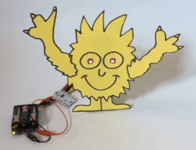
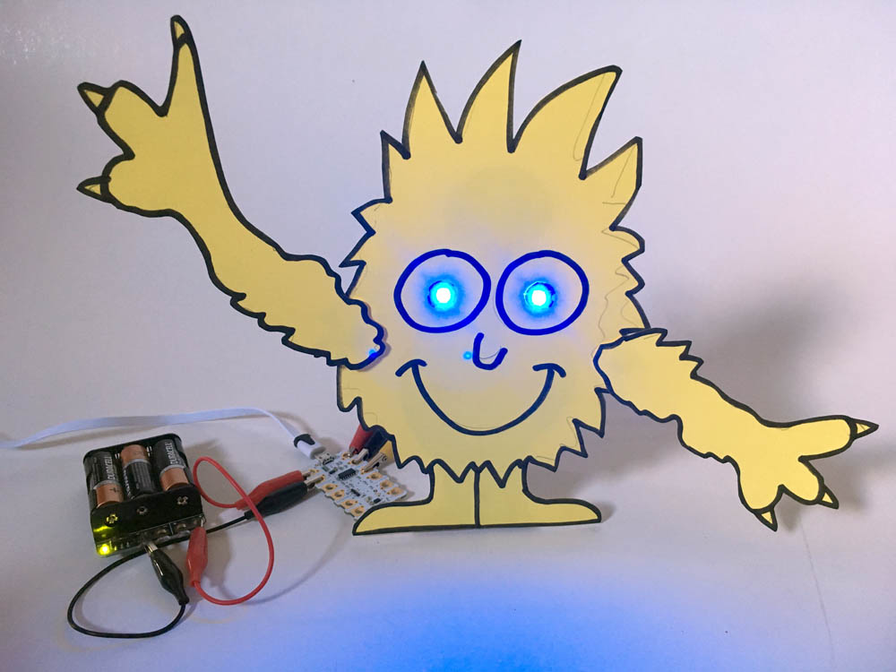

## Introduction

You will use your making skills to build a model 'creature' using Crumble Sparkles for its eyes. You will write code using Crumble software to control how your creature's eyes light up.

### What you will make

It is up to you what your creature looks like and how its eyes flash, glow and change colour.

--- no-print ---

--- /no-print ---

--- print-only ---

--- /print-only ---

--- collapse ---
---
title: What you will need
---
### Hardware

+ A PC, Mac or Chromebook with Crumble software installed and a USB port
Note: The components below are all included in the Crumble starter kit but can also be bought separately.
+ A Crumble controller
+ Two Crumble Sparkles
+ A 3xAA battery pack
+ Crocodile leads
+ Materials to make your 'creature', e.g. card, cardboard and pens
+ tools to make your creature, e.g. glue or tape, and scissors
Note: What materials and tools you need will depend on the creature you choose to make.

### Software

+ [Crumble software](https://redfernelectronics.co.uk/crumble-software/){:target="_blank"}

### Downloads

+ [rpf.io/project-name-go](http://rpf.io/project-name-go){:target="_blank"}

--- /collapse ---

--- collapse ---
---
title: What you will learn
---

+ How to connect multiple Crumble Sparkles to a Crumble controller
+ How to randomise the colour of your Sparkles
+ How to use variables to control the colour of your Sparkles

--- /collapse ---

--- collapse ---
---
title: Additional information for educators
---

If you need to print this project, please use the [printer-friendly version](https://projects.raspberrypi.org/en/projects/http://rpf.io/p/en/scratch-cat-goes-skiing-get/print){:target="_blank"}.

[Here is a link to the resources for this project](http://rpf.io/http://rpf.io/p/en/scratch-cat-goes-skiing-get-go).

--- /collapse ---
