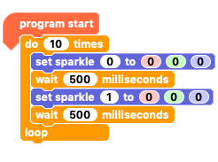
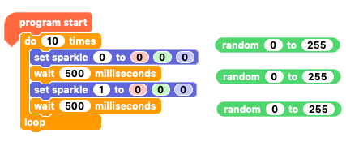
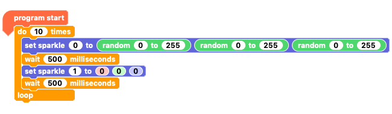
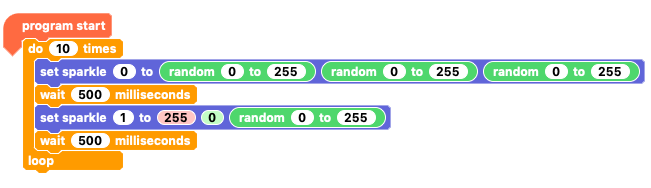
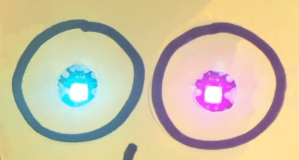
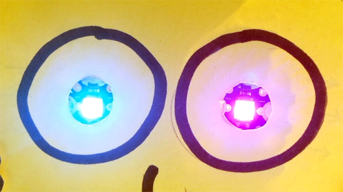

## Colour sequence 4 - random Sparkles colours

Now you are going to make your creature's eyes change to random colours by randomising the RGB values. We can control the range to get random colours within a certain range of to allow any colour at all!

--- task ---

To begin with, grab the `program start`{:class="crumblebasic"} block and add a `do 10 times`{:class="crumblecontrol"} loop block from the `control`{:class="crumblecontrol"} block palette.

--- /task ---

--- task ---

Inside the `repeat`{:class="crumblecontrol"} loop, add a `set sparkle 0 to`{:class="crumblesparkles"}`0`{:class="block3myblocks"}`0`{:class="block3operators"}`0`{:class="block3motion"} RGB value block followed by a `wait 100 milliseconds`{:class="crumblecontrol"} block.

Duplicate both these blocks and then join them to the originals.

Change the second from `Sparkle 0`{:class="crumblesparkles"} to `Sparkle 1`{:class="crumblesparkles"} and change the `wait`{:class="crumblecontrol"} times to `500 milliseconds`{:class="crumblecontrol"} (which is `half a second`{:class="crumblecontrol"}).

--- /task ---

For `Sparkle 0`{:class="crumblesparkles"} we're going to give it the full range of colours.

--- task ---

Grab a `random 0 to 10`{:class="crumbleoperators"} block from the `Operators`{:class="crumbleoperators"} block palette and place it in the coding workspace but not attached to your code.

Change the maximum value to `255`{:class="crumbleoperators"} and duplicate the block twice.

--- /task ---

--- task ---

Now place one `random 0 to 255`{:class="crumbleoperators"} block in each of the RGB value boxes of the `set sparkle 0 to`{:class="crumblesparkles"}`0`{:class="block3myblocks"}`0`{:class="block3operators"}`0`{:class="block3motion"} block.

Click the green play button and watch the completely random colours.

--- /task ---

For the other eye, `Sparkle 1`{:class="crumblesparkles"}, you're going to set a random colour range. In this case, we will use the colour range between red and purple, but you can try other ranges too.

--- task ---

Duplicate one of the `random 0 to 255`{:class="crumbleoperators"} blocks and place it in the `blue`{:class="block3motion"} value box of the `set sparkle 1 to`{:class="crumblesparkles"}`0`{:class="block3myblocks"}`0`{:class="block3operators"}`0`{:class="block3motion"} block.

Set the `red`{:class="block3myblocks"} value to `255`{:class="block3myblocks"} and leave the `green`{:class="block3operators"} value to `0`{:class="block3operators"}.

Since `255`{:class="block3myblocks"}`0`{:class="block3operators"}`0`{:class="block3motion"} is red and `255`{:class="block3myblocks"}`0`{:class="block3operators"}`255`{:class="block3motion"} is purple, our `set sparkle 1 to`{:class="crumblesparkles"}`255`{:class="block3myblocks"}`0`{:class="block3operators"}`0 to 255`{:class="block3motion"} block should give us the full range from red to purple.

Click the green play button again and see Sparkle 1's restricted colur range.

--- /task ---

--- no-print ---

--- /no-print ---

--- print-only ---

--- /print-only ---

