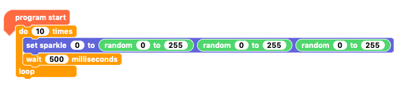
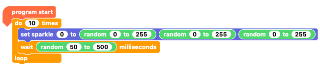
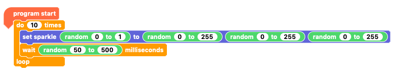
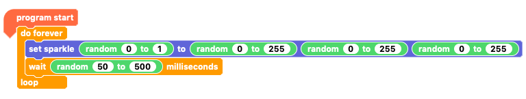
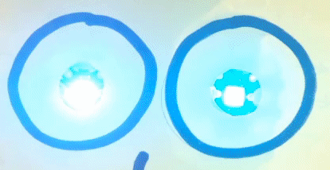
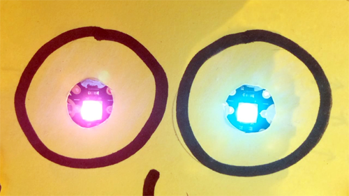

## Create completely random Sparkle colour sequences

Now combine the random pauses and the random colours with randomising which Sparkle changes!

--- task ---

Start with the program that creates random colours.

Delete the last two blocks in the `repeat`{:class="crumblecontrol"} loop so that you have one `set sparkle`{:class="crumblesparkles"} RGB value block and one `wait 500 milliseconds`{:class="crumblecontrol"} block.

--- /task ---

--- task ---

Get another `random`{:class="crumbleoperators"} block and place it **inside** the `wait`{:class="crumblecontrol"} block as the `wait value`{:class="crumblecontrol"}.

Set the new `random`{:class="crumbleoperators"} block's minimum value to `50`{:class="crumbleoperators"} and its maximum value to `500`{:class="crumbleoperators"}

--- /task ---

Now you need code to randomly select `Sparkle 0`{:class="crumblesparkles"} or `Sparkle 1`{:class="crumblesparkles"}.

--- task ---

Grab another `random`{:class="crumbleoperators"} block and place it **inside** the `set sparkle`{:class="crumblesparkles"} block in place of the `0`{:class="crumblesparkles"} that specifies `Sparkle 0`{:class="crumblesparkles"}.

Set the new `random`{:class="crumbleoperators"} block's minimum value to `0`{:class="crumbleoperators"} and its maximum value to `1`{:class="crumbleoperators"}.

Now your program sets random values for the colour, the pause, and which Sparkle changes!

Click on the green triangle **play** button and watch what your creature's eyes do.

--- /task ---

This program finishes running pretty quickly because its `do`{:class="crumblecontrol"} loop runs only 10 times.

Instead of making the program run for longer by increasing the number of times the loop repeats, you can use the `do forever`{:class="crumblecontrol"} loop. A `do forever`{:class="crumblecontrol"} loop makes the code inside it run for as long as  the program runs.

You can stop a Crumble program at any time by clicking on the red **stop** button in the Crumble software window.

--- task ---

From the `Control`{:class="crumblecontrol"} menu, get a `do forever`{:class="crumblecontrol"} loop and place it in your code workspace unattached.

Pull the code out of the existing `do 10 times`{:class="crumblecontrol"} loop and put it inside the new `do forever`{:class="crumblecontrol"} loop.

Discard the `do 10 times`{:class="crumblecontrol"} loop by dragging and dropping it onto the menu area.

Connect the new `do forever`{:class="crumblecontrol"} loop below the `program start`{:class="crumblebasic"} block.

Click on the green triangle **play** button and watch the random colours go on and on!

Then click on the red **stop** button to stop you program.

--- /task ---

--- no-print ---

--- /no-print ---

--- print-only ---

--- /print-only ---
