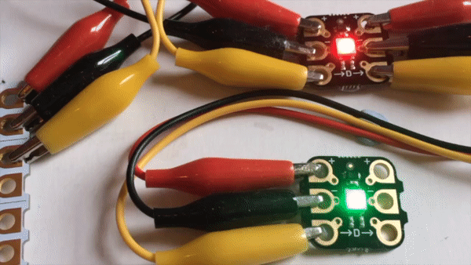

## Challenge: Follow me colour sequence

--- no-print ---

Can you write a program that will make your Sparkles do this?

--- /no-print ---

--- print-only ---

Can you write a piece of code that will make `sparkle 0`{:class="crumblesparkles"} changes from red to amber to green and then repeat that 5 times. Meanwhile, `sparkle 1`{:class="crumblesparkles"} will change in the same sequence but a little delayed, e.g. half a second behind.

So, `sparkle 0`{:class="crumblesparkles"} changes to red, and a few moments later, `sparkle 1`{:class="crumblesparkles"} changes to red. Then after maybe half a second, `sparkle 0`{:class="crumblesparkles"} changes to amber, followed shortly by `sparkle 1`{:class="crumblesparkles"} changing to amberand so on.

--- /print-only ---

--- hints ---

--- hint ---

Use code so that when the `program starts`{:class="crumblebasic"}, the `first Sparkle turns red`{:class="crumblesparkles"}. Then, `after half a second`{:class="crumblecontrol"}, the `second Sparkle also turns red`{:class="crumblesparkles"}. Next, , `after half a second`{:class="crumblecontrol"}, the `first Sparkle turns amber`{:class="crumblesparkles"}. and so on, so that each Sparkle loops through red, amber and green.

--- /hint ---

--- hint ---

The Sparkles never change at the same time so you will need to add extra `wait`{:class="crumblecontrol"} blocks to separate all the `set sparkle to`{:class="crumblesparkles"} blocks.

You will also need to rearrange the `set sparkle 1 to`{:class="crumblesparkles"} blocks so that they match the `set sparkle 0 to`{:class="crumblesparkles"} blocks.

--- /hint ---

--- /hints ---