## Colour sequence 6 - gradual colour changes

Enough with the random changes. Now you are going to make a controlled gradual change from one colour to another.

To do this, you'll make a variable to represent the RGB blue value. You'll then set the blue RGB values of all Sparkles to that variable. As you change the value of the variable, the amount of blue in the Sparkle's colour will change too. 

You'll be seeing many blocks that we've not used before. Let's give it a try.

--- task ---

Begin with the `program start`{:class="crumblebasic"} block.

Now go to the `Variables`{:class="crumblevariables"} palette and click `Add New Variable`{:class="crumblevariables"}.

Type the name blue value and as you click RETURN the new variable `blue value`{:class="crumblevariables"} appears in the list.

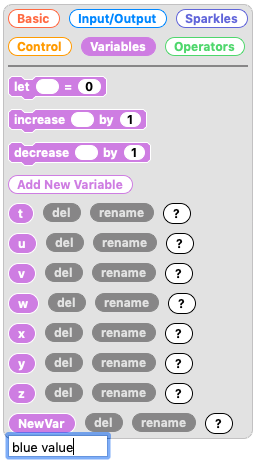

--- /task ---

Now that you have created a variable to use, you need to set a starting value for it.

--- task ---

From the `Variables`{:class="crumblevariables"} palette grab a `let # = 0`{:class="crumblevariables"} block and connect it underneath your `program start`{:class="crumblebasic"} block.

From the very bottom of the `Variables`{:class="crumblevariables"} palette, take a rounded edge `blue value`{:class="crumblevariables"} block and slot it into the blackspace in the `let # = 0`{:class="crumblevariables"} block.

Leave the `blue value`{:class="crumblevariables"} set to 0.

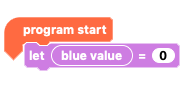

--- /task ---

To create a code that will turn the eyes gradually from red to purple, we want the RGB `red`{:class="block3myblocks"} value to always be `255`{:class="block3myblocks"}, the RGB `green`{:class="block3operators"} value to always be `0`{:class="block3operators"} but have the RGB `blue`{:class="block3motion"} value to move incrementally from `0`{:class="block3motion"} to `255`{:class="block3motion"}.

We are going to use code to `increase the blue value`{:class="crumblevariables"} `until`{:class="crumblecontrol"} it `equals 255`{:class="crumbleoperators"}.

--- task ---

From the `Control`{:class="crumblecontrol"} palette find the `do until`{:class="crumblecontrol"} loop and connect this to you code.

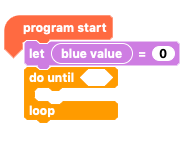

--- /task ---

--- task ---

From `Operators`{:class="crumbleoperators"}, find the hexagonal `0 = 0`{:class="crumbleoperators"} block and insert it into the `do until`{:class="crumblecontrol"} loop right after `until`{:class="crumblecontrol"}.

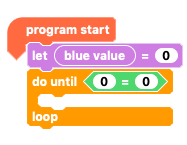

--- /task ---

--- task ---

From the `Variables`{:class="crumblevariables"} palette, take another rounded edge `blue value`{:class="crumblevariables"} block and place it into the first `0`{:class="crumbleoperators"} of the `0 = 0`{:class="crumbleoperators"} block.

Change the second `0`{:class="crumbleoperators"} to `255`{:class="crumbleoperators"}.

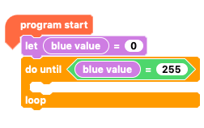

--- /task ---

The condition has been set and so the loop will `repeat until`{:class="crumblecontrol"} the `blue value`{:class="crumblevariables"} variable `equals 255`{:class="crumbleoperators"}.

Now we need to say what happens until that condition is met, i.e. until the `blue value`{:class="crumblevariables"} variable `equals 255`{:class="crumbleoperators"}.

--- task ---

In the `Sparkles`{:class="crumblesparkles"} palette, look for block which sets an RGB value for `all Sparkles`{:class="crumblesparkles"}. Pull it out and connect it inside your `repeat until`{:class="crumblecontrol"} loop.

Set the `red`{:class="block3myblocks"} value to `255`{:class="block3myblocks"}.

Set the `green`{:class="block3operators"} value to `0`{:class="block3operators"}.

Place a `blue value`{:class="crumblevariables"} block in the `blue`{:class="block3motion"} RGB value box.

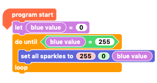

--- /task ---

--- task ---

Take an `increase # by 1`{:class="crumblevariables"} block from the `Variables`{:class="crumblevariables"} palette and put a `blue value`{:class="crumblevariables"} block in its blank space.

Place the `increase blue value by 1`{:class="crumblevariables"} block under your `set all sparkles to`{:class="crumblesparkles"}`255`{:class="block3myblocks"}`0`{:class="block3operators"}`blue value`{:class="crumblevariables"} block.

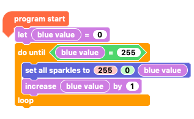

--- /task ---

Another block we have not used before is the `Sparkle`{:class="crumblesparkles"} block that turns all the Sparkles off.

--- task ---

From the `Sparkles`{:class="crumblesparkles"} palette, take a `turn all sparkles off`{:class="crumblesparkles"} block and put it underneath the `do until`{:class="crumblecontrol"} loop. Be careful to put it under the loop and not inside!

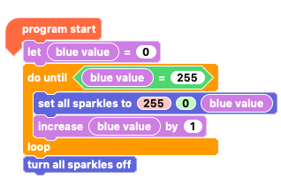

Try running the code and see what it looks like.

--- /task ---

Great. That's red to purple done. Now let's try going from red to purple to blue!

To do that we'll need to set up a `'red value' variable`{:class="crumblevariables"} and have it `decrease`{:class="crumblevariables"} `until`{:class="crumblecontrol"} it reaches `0`{:class="crumblevariables"}.

--- task ---

`Add a new variable`{:class="crumblevariables"} and call it `red value`{:class="crumblevariables"}.

Pull the `turn all sparkles off`{:class="crumblesparkles"} block away from your code so you can easily add more blocks.

Under the `do until`{:class="crumblecontrol"} loop, add a `let # = 0`{:class="crumblevariables"} block, add a `red value`{:class="crumblevariables"} block to the empty field and set the value to `255`{:class="crumblevariables"}.

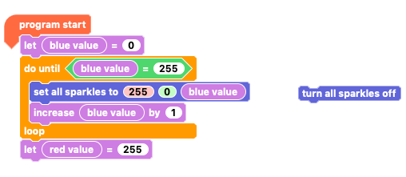

--- /task ---

We need to build a `do until`{:class="crumblecontrol"} loop like the last one to change `red value`{:class="crumblevariables"} from `255`{:class="crumblevariables"} to `0`{:class="crumblevariables"}.

--- task ---

Grab another `do until`{:class="crumblecontrol"} loop and put a `0 = 0`{:class="crumbleoperators"} block in its hexagonal space.

Drag a `set all sparkles to`{:class="crumblesparkles"}`0`{:class="block3myblocks"}`0`{:class="block3operators"}`0`{:class="block3motion"} block into the `repeat until`{:class="crumblecontrol"} loop.

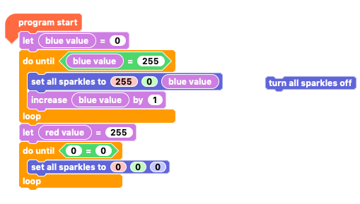

--- /task ---

--- task ---

Put a `red value`{:class="crumblevariables"} block in place of the first `0`{:class="crumbleoperators"} of `0 = 0`{:class="crumbleoperators"}, and leave the second as `0`{:class="crumbleoperators"}.

In the `set all sparkles to`{:class="crumblesparkles"}`0`{:class="block3myblocks"}`0`{:class="block3operators"}`0`{:class="crumblevariables"} block:

In the `red`{:class="block3myblocks"} value box put a `red value`{:class="crumblevariables"} block.

Leave the `green`{:class="block3operators"} value at `0`{:class="block3operators"}.

The `blue`{:class="block3motion"} value box can either be set at `255`{:class="block3motion"} or have a `blue value`{:class="crumblevariables"} block inside.

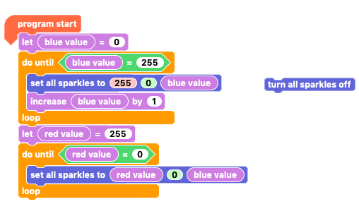

--- /task ---