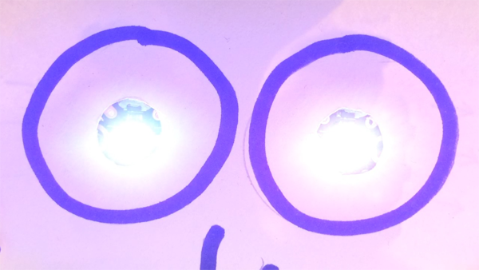

## Create gradual colour changes

Now you are going to make the Sparkles change colour in a controlled, gradual way.

To do this, you need a variable to represent the RGB blue value. Then you set the blue RGB value of **both** Sparkles to that variable. Then you can change the value of the variable and thereby change the amount of blue in the Sparkle's colour. 

You need some new code blocks to create this program.

--- task ---

Begin with the `program start`{:class="crumblebasic"} block, as usual.

Now go to the `Variables`{:class="crumblevariables"} menu and click `Add New Variable`{:class="crumblevariables"}.

Type in the name 'blue value'. Click on **RETURN**, and the new variable `blue value`{:class="crumblevariables"} appears in the list.

--- /task ---

Now you need to set a starting value for the `blue value`{:class="crumblevariables"} variable.

--- task ---

From the `Variables`{:class="crumblevariables"} menu, grab a `let = 0`{:class="crumblevariables"} block, and connect it below your `program start`{:class="crumblebasic"} block.

From the **very bottom** of the `Variables`{:class="crumblevariables"} menu, take a **rounded-edge** `blue value`{:class="crumblevariables"} block and put it **inside** the value field of the `let = 0`{:class="crumblevariables"} block.

Leave the `blue value`{:class="crumblevariables"} set to `0`.

--- /task ---

To create a program to turn the creature's eyes gradually from red to purple:

* The RGB `red`{:class="block3myblocks"} value needs to always be `255`{:class="block3myblocks"}
* The RGB `green`{:class="block3operators"} value needs to always be `0`{:class="block3operators"}
* The RGB `blue`{:class="block3motion"} value needs to change gradually from `0`{:class="block3motion"} to `255`{:class="block3motion"}

You need to add code to `increase the blue value`{:class="crumblevariables"} `until`{:class="crumblecontrol"} it `equals 255`{:class="crumbleoperators"}.

--- task ---

From the `Control`{:class="crumblecontrol"} menu, get a `do until`{:class="crumblecontrol"} loop block and connect it below your code.

--- /task ---

--- task ---

From the `Operators`{:class="crumbleoperators"} menu, get a pointy-ended `0 = 0`{:class="crumbleoperators"} block and put it **inside** the `do until`{:class="crumblecontrol"} loop right after `until`{:class="crumblecontrol"}.

--- /task ---

Now you need to change the `do until`{:class="crumblecontrol"} loop so that will repeat until the `blue value`{:class="crumblevariables"} variable `equals 255`{:class="crumbleoperators"}.

--- task ---

From the `Variables`{:class="crumblevariables"} menu, take another rounded-edge `blue value`{:class="crumblevariables"} block and place it inside the **first** `0`{:class="crumbleoperators"} field of the `0 = 0`{:class="crumbleoperators"} block.

Change the second `0`{:class="crumbleoperators"} to `255`{:class="crumbleoperators"}.

--- /task ---

Now you need to tell the `do until`{:class="crumblecontrol"} loop what should happen every time it repeats.

--- task ---

In the `Sparkles`{:class="crumblesparkles"} menu, look for the block which sets an RGB value for `all Sparkles`{:class="crumblesparkles"}. Pull it out and out it **inside** the `repeat until`{:class="crumblecontrol"} loop.

In the `set all Sparkles`{:class="crumblesparkles"} block:

1. Set the `red`{:class="block3myblocks"} value to `255`{:class="block3myblocks"}.

1. Set the `green`{:class="block3operators"} value to `0`{:class="block3operators"}.

1. Place a `blue value`{:class="crumblevariables"} block in the `blue`{:class="block3motion"} RGB value box.

--- /task ---

Now the `blue`{:class="block3motion"} RGB value of the Sparkle is always the same as the `blue value`{:class="crumblevariables"} variable.

--- task ---

From the `Variables`{:class="crumblevariables"} menu, take an `increase by 1`{:class="crumblevariables"} block.

Put a `blue value`{:class="crumblevariables"} block inside the `increase by 1`{:class="crumblevariables"} block.

Attach the `increase blue value by 1`{:class="crumblevariables"} block below your `set all sparkles to`{:class="crumblesparkles"}`255`{:class="block3myblocks"}`0`{:class="block3operators"}`blue value`{:class="crumblevariables"} block.

--- /task ---

Each time the `repeat until`{:class="crumblecontrol"} loop repeats, the `blue value`{:class="crumblevariables"} variable increases by 1, which means the `blue`{:class="block3motion"} RGB value also increases by 1 each time the loop repeats.

Now add a block that turns all the Sparkles off.

--- task ---

From the `Sparkles`{:class="crumblesparkles"} menu, take a `turn all sparkles off`{:class="crumblesparkles"} block and attach it below the `do until`{:class="crumblecontrol"} loop. Be careful to put the new block **below the loop and not inside**!

Click on the green triangle **play** button to run your code and watch what your creature's eyes do.

--- /task ---

Now add code to gradually change the Sparkles from red to purple to blue!

You need to set up a `'red value' variable`{:class="crumblevariables"} with the value `255`{:class="crumblevariables"}, and make its value `decrease`{:class="crumblevariables"} `until`{:class="crumblecontrol"} it reaches `0`{:class="crumblevariables"}.

--- task ---

`Add a new variable`{:class="crumblevariables"} and call it `red value`{:class="crumblevariables"}.

Pull the `turn all sparkles off`{:class="crumblesparkles"} block away from your code so you can add more blocks.

Under the `do until`{:class="crumblecontrol"} loop, add a `let = 0`{:class="crumblevariables"} block.

Put a `red value`{:class="crumblevariables"} block **inside** the new `let = 0`{:class="crumblevariables"} block, and set the `red value`{:class="crumblevariables"} to `255`{:class="crumblevariables"}.

--- /task ---

Now build another `do until`{:class="crumblecontrol"} loop that is similar to the one you already have. But instead of changing `blue value`{:class="crumblevariables"}, the new loop needs to change `red value`{:class="crumblevariables"} from `255`{:class="crumblevariables"} to `0`{:class="crumblevariables"}.

--- task ---

Grab another `do until`{:class="crumblecontrol"} loop and put a `0 = 0`{:class="crumbleoperators"} block inside its pointy-ended field.

Get a `set all sparkles to`{:class="crumblesparkles"}`0`{:class="block3myblocks"}`0`{:class="block3operators"}`0`{:class="block3motion"} block, and place it **inside** the new `do until`{:class="crumblecontrol"} loop.

--- /task ---

--- task ---

In the new `do until`{:class="crumblecontrol"} loop, add a `red value`{:class="crumblevariables"} block in place of the first `0`{:class="crumbleoperators"} of `0 = 0`{:class="crumbleoperators"}, and leave the second `0`{:class="crumbleoperators"} as it is.

In the `set all sparkles to`{:class="crumblesparkles"}`0`{:class="block3myblocks"}`0`{:class="block3operators"}`0`{:class="block3motion"} block:

1. In the `red`{:class="block3myblocks"} value field, put a `red value`{:class="crumblevariables"} block.

1. Leave the `green`{:class="block3operators"} value as `0`{:class="block3operators"}.

1. Either leave the `blue`{:class="block3motion"} value as `255`{:class="block3motion"}, or put a `blue value`{:class="crumblevariables"} block into that field.

--- /task ---

Now the `blue`{:class="block3motion"} RGB value of the Sparkle will always be the same as the `blue value`{:class="crumblevariables"} variable, and the `red`{:class="block3myblocks"} RGB value of the Sparkle will always be the same as the `red value`{:class="crumblevariables"} variable.

Now add a variable block telling the `red value`{:class="crumblevariables"} variable to `decrease by 1`{:class="crumblevariables"} each time the loop repeats.

--- task ---

Add a `decrease by 1`{:class="crumblevariables"} block under the `set all sparkles to`{:class="crumblesparkles"}`red value`{:class="crumblevariables"}`0`{:class="block3operators"}`blue value`{:class="crumblevariables"} block.

Insert a `red value`{:class="crumblevariables"} block into the blank space of the `decrease by 1`{:class="crumblevariables"} block.

Finally, put the `turn all sparkles off`{:class="crumblesparkles"} block back at the bottom of the code.

Now click on the green triangle **play** button to run your code, and watch the gradual colour changes.

--- /task ---

--- no-print ---

--- /no-print ---

--- print-only ---

--- /print-only ---