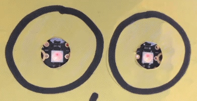
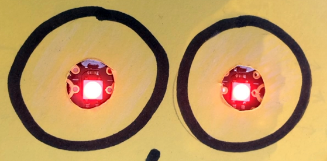
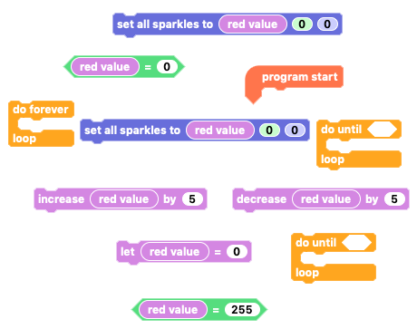

## Challenge: Pulsing light sequence

Can you code your Sparkle creature's eyes to pulse from off to bright red,back to nothing and so on forever?

This is not just turning from off to red, but gradually getting brighter and brighter and then gradually dimmer and dimmer, and so on, using variables to control the RGB values like you did in the gradual colour change code.

--- no-print ---

--- /no-print ---

--- print-only ---

--- /print-only ---

--- hints ---

--- hint ---

Try and write code so that when the `program starts`{:class="crumblebasic"}, a `red value`{:class="crumblevariables"} is set to `0`{:class="crumblevariables"}, then `forever`{:class="crumblecontrol"} keep on `increasing`{:class="crumblevariables"} the `red`{:class="block3myblocks"} RGB value of the `Sparkles`{:class="crumblesparkles"} by 5 `until`{:class="crumblecontrol"} it `equals 255`{:class="crumbleoperators"}, then `decreasing`{:class="crumblevariables"} the `red`{:class="block3myblocks"} RGB value of the `Sparkles`{:class="crumblesparkles"} by 5 `until`{:class="crumblecontrol"} it `equals 0`{:class="crumbleoperators"}.

--- /hint ---

--- hint ---

You will need to use the blocks below to create the pulsing colour sequence code.

There are two `do until`{:class="crumblecontrol"} loops, both of which will sit inside the `do forever`{:class="crumblecontrol"} loop.

--- /hint ---

--- hint ---

Arrange the code blocks to make the code below:

Click the green 'play' button to see if it works as you expect.

--- /hint ---

--- /hints ---

