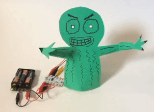
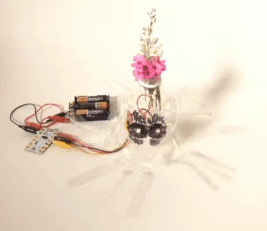
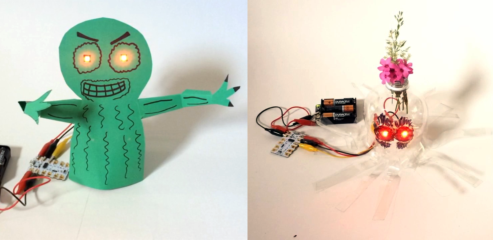

## Invent your creature

You are going to design and make a creature with two Crumble Sparkles for its eyes. You decide what the creature will be: an animal, a monster, a person, or anything you can imagine.

+ Imagine the creature you want to make, and then design it.

+ Make a sketch first to help you along the way.

I am going to make a simple creature as an example, but you can make whatever you like.

### What will your creature be made of?

There is no wrong way to make your creature, just lots of right ways!

+ You could cut out a card or cardboard front.
+ For a stand, using card, wood, or even a toilet roll  works great.
+ Re-using little boxes or drinks bottles is also a great idea.

Use this project to try out creative designing, creative making, and creative coding and make any sort of creature you like.

--- no-print ---

--- /no-print ---

--- print-only ---

--- /print-only ---

In this project guide, I will show you one possible example creature, but you can use your own design and materials.

--- task ---

Draw your creature design in pencil.

+ Thin card is easy to cut, but cardboard makes a much stronger model. Choose whatever material works best for your design.

+ Start by sketching lightly in pencil, so you can easily correct your drawing  and make improvements.

If your design is really simple, you could draw it straight onto the card or cardboard that you are using, like in the example.

I kept the arms separate so I could stick them on separately. This makes the shapes a little easier to cut out. I could even make the arms movable later.

Instead of separate arms, your creature might have:
+ A tail
+ Ears
+ Wings
+ A unicorn horn
+ Antennae
+ Whatever you like

--- /task ---

--- task ---

Once your sketch looks as you like it, go over it in pen to make it clear and bold.

--- /task ---

The following picture shows optional tools for cutting out your design:
+ Heavy-duty scissors
+ A serrated box cutter
+ A scalpel craft knife

If you don't have any of these, use normal scissors.

--- task ---

Cut out your creature shape.

If you are using scissors, it is useful to cut out the rough shape out first:

Then it is much easier to accurately cut out your shape:

--- /task ---

My creature is drawn on quite thin card, so my creature would be unstable once it has Sparkles and leads attached. Therefore, I support it with a bit of cardboard.

--- task ---

If your creature needs support too:
+ Draw round your creature shape on a bit of cardboard.
+ Mark where the Sparkles will go so you can avoid that area.
+ In the space that is left, draw the shape of your support piece so it is clearly inside the lines of your creature shape.

--- /task ---

--- task ---

+ Cut out the cardboard support shape.
+ Stick the support to the back of your creature. You could use a cool melt glue gun,double-sided tape, or even PVA glue if you can wait for it to dry (about half an hour).

--- /task ---

--- task ---

Now make your creature stand up:

+ Cut out a cardboard triangle with a right angle.
+ Add the triangle at 90° to the support shape.

--- /task ---

Your creature should now be able to stand on its own:

--- task ---

+ Stick on any extra bits that you have for your creature.

If you use **split-pin paper fasteners**, the extra bits will be movable. Or instead, you could use Blu Tack or glue.

--- /task ---
