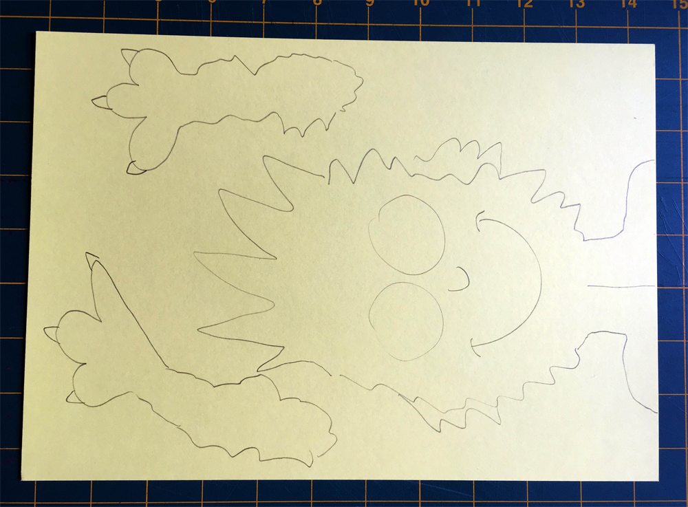
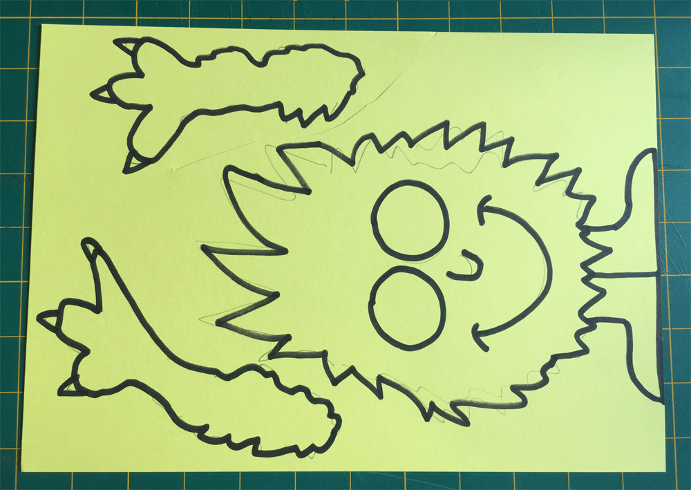
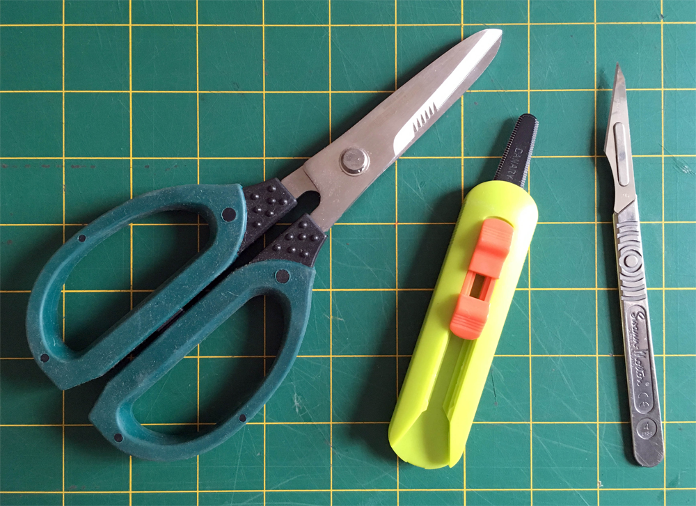

## Making your Creature

We are going to design and make our 'creature' which will have two Crumble Sparkles for its eyes. You can make an animal, a monster, a person, or anything you like. It can be something really quick and simple or become a big making project.

The first step is to decide what you want to make and design it. It is helpful to make a sketch first. In this project, I am going to make something simple as an example but you can change it to be whatever you like.

--- task ---

Draw your creature design in pencil. Starting by sketching lightly in pencil is great because you can easily correct any mistakes and make improvements.

If it is really simple you might just draw it straight onto the card or cardboard that you are using like I have done in this example.

I have kept the arms separate as I have decided to stickthe arms on separately. This makes it a little easier to cut out and I might make the arms movable.

Thin card is easy to cut but cardboard will make a much stronger model. Choose whatever works best for you.

--- /task ---

--- task ---

Once you have your design as you like it, go over it in pen to make it clear and bold.

--- /task ---

Thin cardboard is still fairly easy to cut with normal scissors but there are many tools that can make this job much easier and more fun. Having tools like the heavy duty scissors, serrated box cutter and even a scalpel craft knife shown below widen your making possibilities.

--- task ---

Cut your creature

--- /task ---

--- task ---

--- /task ---

--- task ---

--- /task ---

--- task ---

--- /task ---

--- task ---

--- /task ---

--- task ---

--- /task ---

