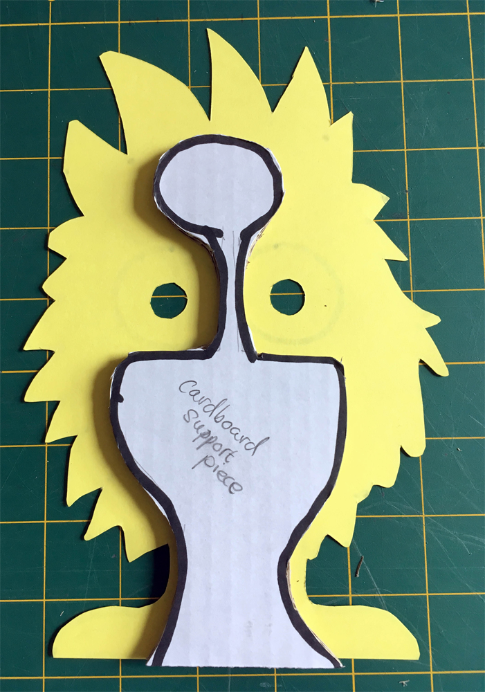

## Making your creature

We are going to design and make our 'creature' which will have two Crumble Sparkles for its eyes. You can make an animal, a monster, a person, or anything you like. It can be something really quick and simple or become a big making project.

The first step is to decide what you want to make and design it. It is helpful to make a sketch first. In this project, I am going to make something simple as an example but you can change it to be whatever you like.

### What does a creature look like?

There is not really any wrong way to make your creature, just lots of right ways!

cutting out a card or cardboard front and using card, wood or even a toilet roll for a stand works great but you canuse your creativity to make any sort of creature you like. How about upcycling some little boxes or even used drinks bottles?

Use this project to explore your cretive designing, creative making and creative coding!

--- no-print ---

--- /no-print ---

--- print-only ---

--- /print-only ---

For the sake of this project, we will look at one possible make, but you can adapt this to your own design and materials.

--- task ---

Draw your creature design in pencil. Starting by sketching lightly in pencil is great because you can easily correct any mistakes and make improvements.

If it is really simple you might just draw it straight onto the card or cardboard that you are using like I have done in this example.

I have kept the arms separate as I have decided to stickthe arms on separately. This makes it a little easier to cut out and I might make the arms movable.

Thin card is easy to cut but cardboard will make a much stronger model. Choose whatever works best for you.

--- /task ---

--- task ---

Once you have your design as you like it, go over it in pen to make it clear and bold.

--- /task ---

Thin cardboard is still fairly easy to cut with normal scissors but there are many tools that can make this job much easier and more fun. Having tools like the heavy duty scissors, serrated box cutter and even a scalpel craft knife shown below widen your making possibilities.

--- task ---

Cut your creature shape out.

If you are using scissors, and especially if you are cutting curves and complicated shapes, it is much easier to cut the rough shape out first and get rid of as much of the waste material (the bits you are cuttign away) as possible.

Now it is much easier to accurately cut your shape out just cutting a little of the card or cardboard off.

--- /task ---

As IO have used quite thin card, I know my creature will start to flop around a bit once it has Sparkles and leads attached so I am going to strenghten it up with a bit of carboard.

--- task ---

If your creature needs a support too, draw round your creature shape on a bit of cardboard, and then mark where the Sparkles will go so we can avoid that area.

In the space that is left, mark out the shape of your support piece so that it stays clearly inside the lines of your creature shape.

--- /task ---

--- task ---

Cut the cardboard support out and stick it to the back of your creature. 

I used a cool melt glue gun, but you could also use double-sided tape or even PVA glue if you can wait for it to dry (about half an hour).

--- /task ---

--- task ---

Now add another piece of cardboard at 90° to the support to let your creature stand up.

--- /task ---

Your creature should now be able to stand on its own two feet... or as many feet as you gave your creature!

My creature still needs arms!

--- task ---

Stick any extra bits that you have for your creature. My creature needs arms but your might have a tail, ears, wings, a unicorn horn, antennae or whatever you like.

You can fix these in place with cool melt glue or have them moving using split pin paper fasteners. I decided to go half-way between fixed and moving and attached mine with Blu Tack.

--- /task ---
