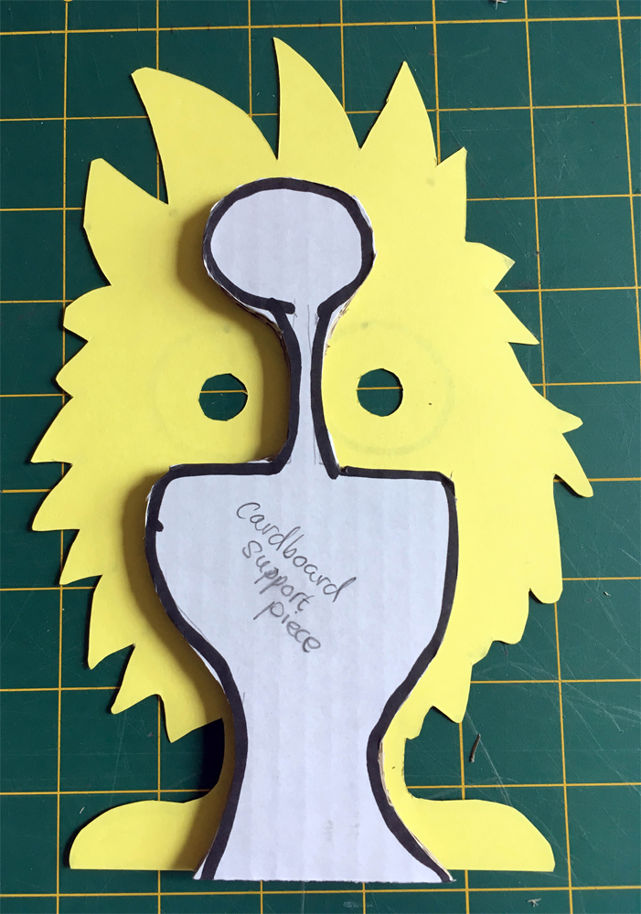
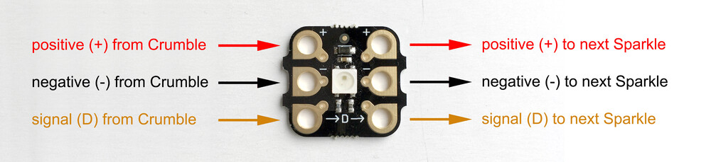
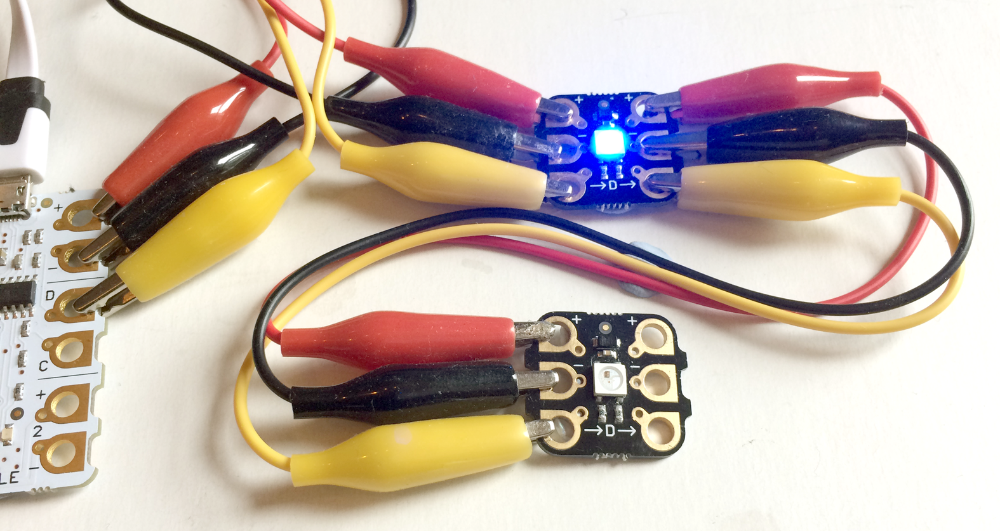

## Connecting the Sparkles

In the Getting started with Crumble project we learned how to connect up a Crumble Sparkle to the Crumble controller board by connecting the Crumble's positive output to the Sparkle's positive input, negative output to negative input and the Crumble's 'D' terminal to the Sparkle's 'D' terminal input.

[[[connect-single-sparkle]]]

Now it's time to connect a second Sparkle to the first one. The positive, negative and signal (D) pass through the first Sparkle and output to the second Sparkle.

--- task ---

Connect a croc clip from the first Sparkle's positive (+) output terminal on the right-hand side to the second Sparkle's positive (+) input terminal on the left-hand side. Then repeat this for the negative (-) output to negative (-) input, and finally, signal (D) output from the first Sparkle to the signal (D) input on the second Sparkle.

--- /task ---

--- task ---

--- /task ---

--- task ---

--- /task ---

--- task ---

--- /task ---
