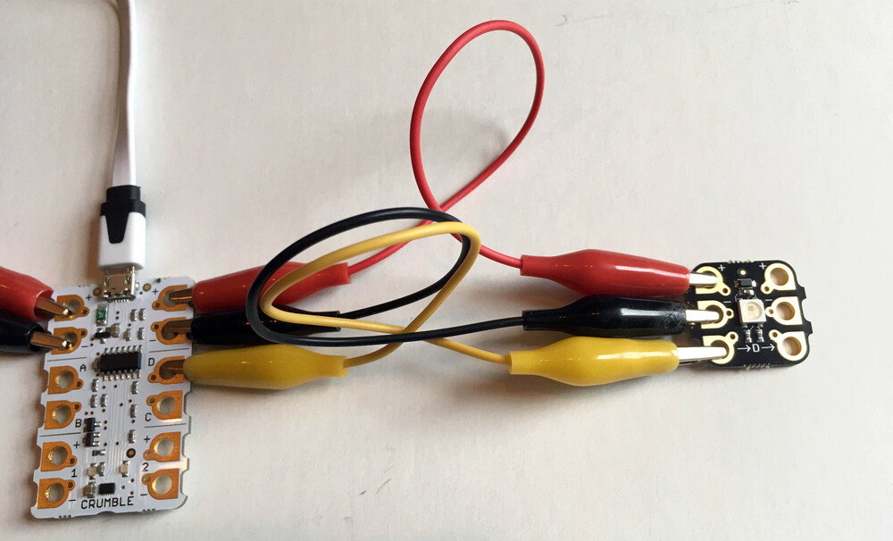
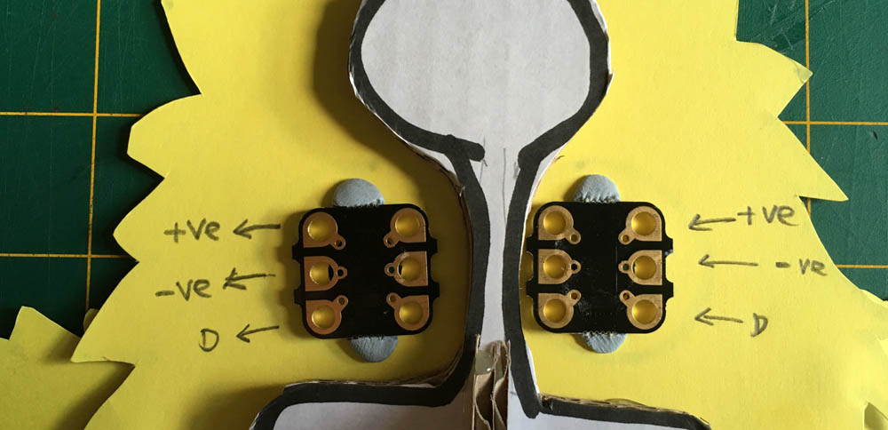
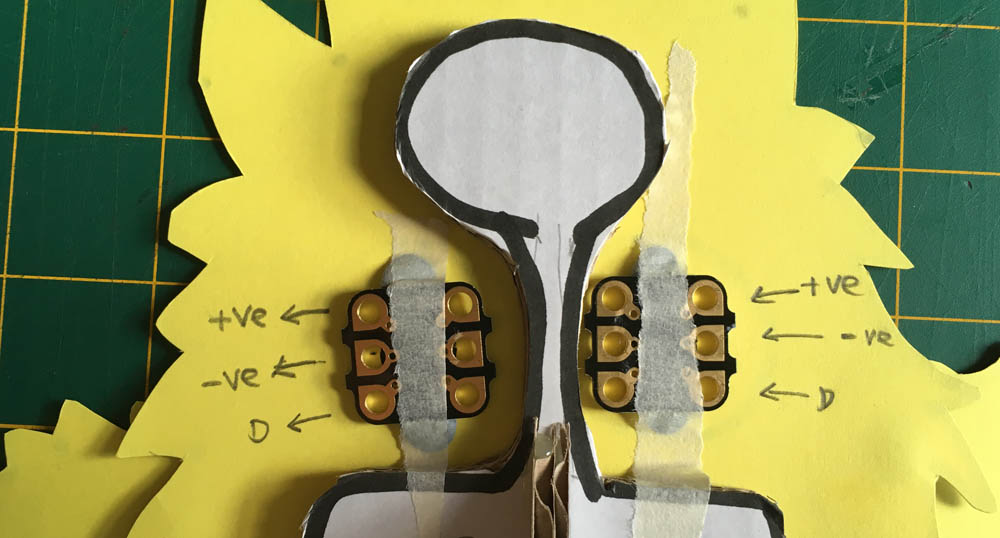
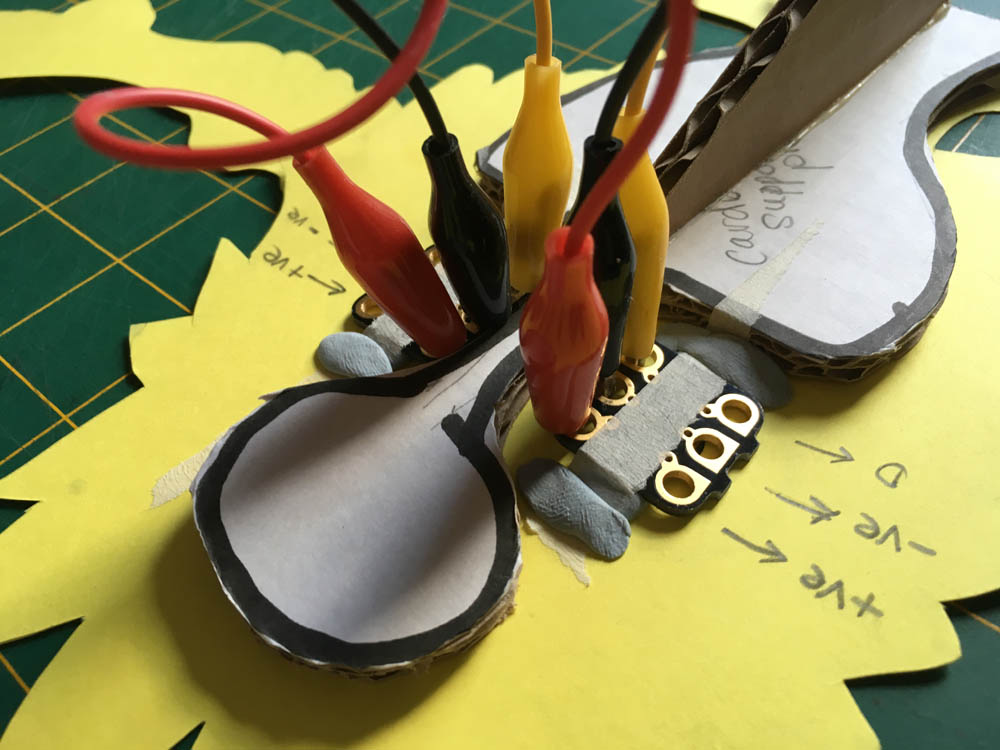
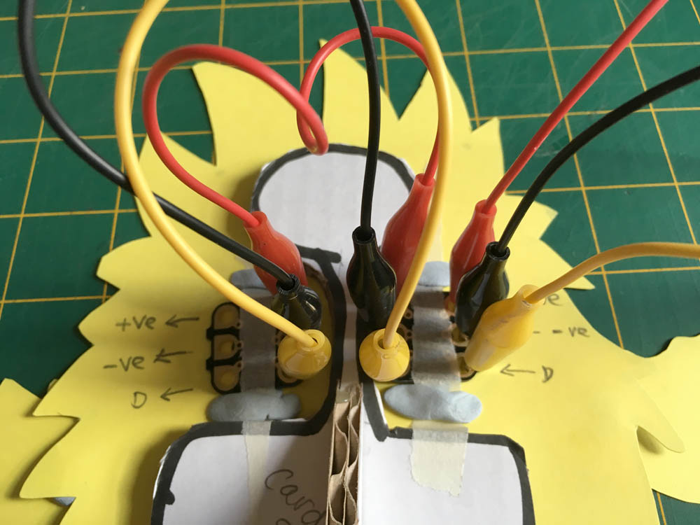
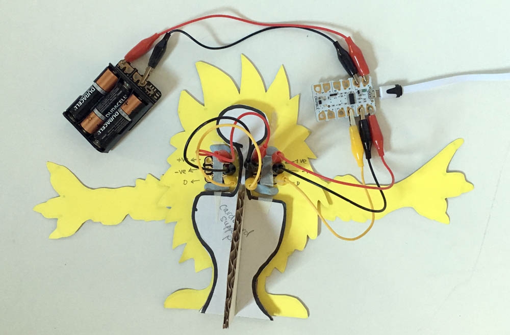
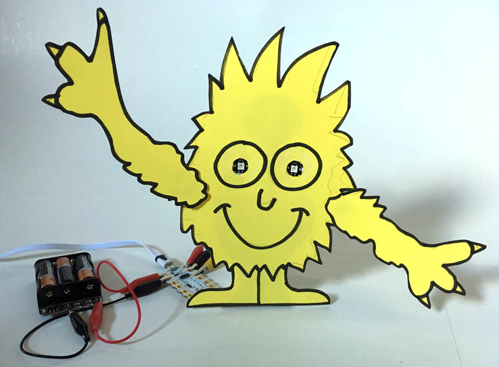

## Connecting the Sparkles

In the Getting started with Crumble project we learned how to connect up a Crumble Sparkle to the Crumble controller board by connecting the Crumble's positive output to the Sparkle's positive input, negative output to negative input and the Crumble's 'D' terminal to the Sparkle's 'D' terminal input.

[[[connect-single-sparkle]]]

Now it's time to connect a second Sparkle to the first one. The positive, negative and signal (D) pass through the first Sparkle and output to the second Sparkle.

--- task ---

Connect a croc clip from the first Sparkle's positive (+) output terminal on the right-hand side to the second Sparkle's positive (+) input terminal on the left-hand side.

Repeat this for the negative (-) output to negative (-) input, and finally, signal (D) output from the first Sparkle to the signal (D) input on the second Sparkle.

--- /task ---

That's our complete setup and if you want, you can just attach this straight to your creature and you are ready to start coding. It is a little tricky so now that we know exactly how it all goes together, it might be easier to take the leads off and then start by fixing the Sparkles to our creature.

--- task ---

Once you have removed the leads, fix the two Sparkles in place being careful to note which way up they are. In this project the positive (+) terminal is at the top and the 'D' terminal at the bottom.

I have used a little Blu Tack at the top and bottom of each Sparkle. Whatever you use, just make sure that the Sparkle terminals are accessible.

I have actually marked which terminal is which AND the direction (with arrows) from Sparkle 0 to Sparkle 1. 

Note: If you get the direction wrong and connect the Crumble directly to the Sparkle's output, the Sparkles will not light up!

If the Saprkles are a little loose you could add a thin strip of tape across the middle.

--- /task ---

--- task ---

Now connect the leads between the two Sparkles, potove to positive, negative to negative and signal (D) to signal (D). 

As long as the Sparkles are the same way up, this will always be the sets of terminals next to each other in the middle of your creature.

--- /task ---

--- task ---

Now connect the leads that will come from the Crumble itself. Make sure they go to the input terminals of Sparkle 0.

Note: When you look at the front of a Sparkle, the inputs are on the left-hand side. Wiring up your creature, you are seeing the Sparkle from the back so the inputs are on the right-hand side as in the image below.

--- /task ---

--- task ---

If they are not already connected, connect the positve lead going to the first Sparkle (Sparkle 0) to the positive output from the Crumble. Then connect the negative to negative, and signal 'D' lead to the 'D' terminal of the Crumble

--- /task ---

That's it. Your creature should now be good to go, and ready to be coded!

