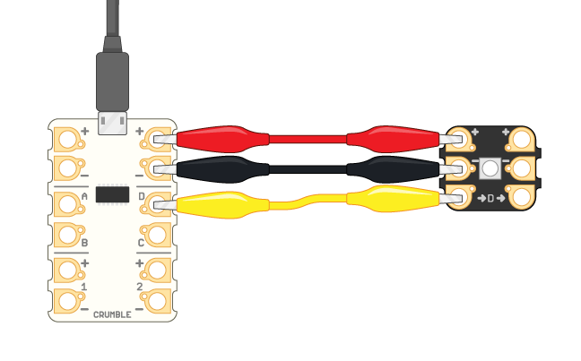
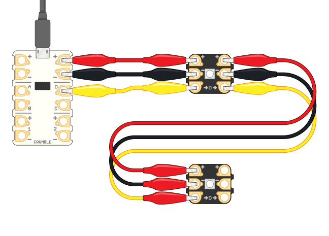

## How to connect the Sparkles

To connect a Crumble Sparkle to the Crumble controller board, you use crocodile clip cables to connect:
1. The Crumble's positive output to the Sparkle's positive input
1. The Crumble's negative output to the Sparkle's negative input
1. The Crumble's D terminal to the Sparkle's D terminal input

--- task ---

Connect your first Sparkle to your Crumble controller:

[[[connect-single-sparkle]]]

--- /task ---

Now it's time to connect the second Sparkle to the first one. The positive, negative, and signal (D) pass through the first Sparkle and to the second Sparkle.

--- task ---

Use a crocodile clip cable to connect the first Sparkle's positive **output** terminal (+ on the **right-hand** side) to the second Sparkle's positive **input** terminal (+ on the **left-hand side**).

Do the same for the first Sparkle's negative (-) **output** and the second Sparkle's negative (-) **input**.
Finally, do the same for the first Sparkle's signal (D) **output** and the second Sparkle's signal (D) **input**.

--- /task ---

Your Sparkles are now set up, but it's tricky to attach them to your creature when they have cables connected.

If you want, you can take the cables off again and fix the Sparkles to your creature by themselves first.

--- task ---

+ Remove the cables.
+ Fix the two Sparkles to the creature, for example using Blu Tack. **Important:** make sure that the Sparkle terminals are not covered, and note which way up the Sparkles are.

**Note:** if you get the direction wrong and connect the Crumble directly to the Sparkle's output, the Sparkles will not light up!

In the example pictures, the positive (+) terminal is at the top and the D terminal at the bottom. I have marked which terminal is which, and the direction from the first to the second Sparkle: 

If the Sparkles are a bit loose, you can add a thin strip of tape across the middle.

--- /task ---

--- task ---

Now connect the crocodile cable in between the two Sparkles again:
+ Positive to positive
+ Negative to negative
+ Signal (D) to signal (D)

If the Sparkles are the same way up, the terminals you need to connect are next to each other in the middle of your creature.

--- /task ---

--- task ---

Now use more crocodile cables to connect your Crumble to the **input** terminals of your **first** Sparkle:

+ The positve input of the first Sparkle (Sparkle 0) to the positive output of the Crumble.
+ The negative input of the first Sparkle (Sparkle 0) to the negative output of the Crumble.
+ The D signal input of the first Sparkle (Sparkle 0) to the D terminal of the Crumble.

**Note:** when you look at the front of a Sparkle, the inputs are on the left-hand side. While you are adding cables to your creature, you are seeing the Sparkle from the back, so the inputs are on the right-hand side, as in the image below:

--- /task ---

--- task ---

If they are not already connected, connect the Crumble and battery pack:
+ Use a crocodile clip cable to connect the positve input of the Crumble to the battery pack's positive terminal.
+ Use another crocodile clip cable to connect the negative input of the Crumble to the battery pack's negative terminal.

--- /task ---

Your creature is now ready to be coded!

