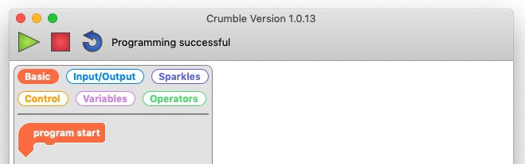
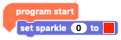
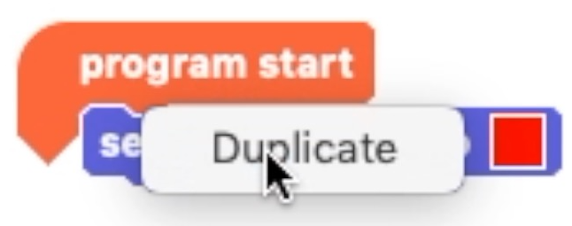
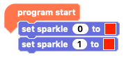
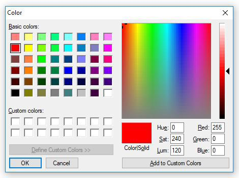
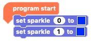

## How to program two Sparkles

Start with a really simple program for two Sparkles.

--- task ---

Open the Crumble software on your computer, and click the play button to check that the computer and Crumble are talking to each other.

At the top of the window, you should see the message **Programming successful**.

From the `Basic`{:class="crumblebasic"} blocks menu, grab the `program start`{:class="crumblebasic"} block that starts every bit of Crumble code.

--- /task ---

--- task ---

Now switch to the `Sparkles`{:class="crumblesparkles"} menu. Take a `set sparkle 0 to`{:class="crumblesparkles"} block with a **colour picker box**, and add this block below the `program start`{:class="crumblebasic"} block.

--- /task ---

--- task ---

Right-click on the `set sparkle 0 to`{:class="crumblesparkles"} block and then click on **Duplicate**. 

--- no-print ---

--- /no-print ---

--- print-only ---

--- /print-only ---

Attach the duplicated `set sparkle`{:class="crumblesparkles"} block below the original `set sparkle`{:class="crumblesparkles"} block. Click on the `0` in the duplicated block and change it to a `1`.

**Note:** the Crumble software's numbering system starts at 0, so the first Sparkle is called 'sparkle 0' and the second is called 'sparkle 1'.

--- /task ---

--- task ---

Click on each colour picker box and choose a new colour for each of the Sparkles. 

**Note:** how the colour colour picker menu looks depends on what operating system you are using (e.g. Windows or macOS).

Then click on the green triangle **play** button to run the code and see your Sparkles light up.

--- /task ---

If you want to add more Sparkles to your creature, connect them in the same way in which you connected the second Sparkle: the output of one Sparkle to the input of the next.

In your program, a third Sparkle would be named `sparkle 2`{:class="crumblesparkles"}, a fourth would be named `sparkle 3`{:class="crumblesparkles"}, and so on.