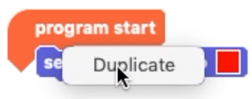
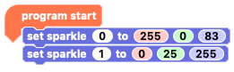

## Coding two Sparkles

Let's start with a really simple two Sparkle code.

--- task ---

Open the Crumble software on your computer and click the play button just to check that the computer and Crumble are talking to each other.

You should get the message "programming successful".

From the `Basic`{:class="crumblebasic"} palette, grab the `program start`{:class="crumblebasic"} block that starts every bit of Crumble code.

--- /task ---

--- task ---

Now switch to the `Sparkles`{:class="crumblesparkles"} palette and take a `set sparkle 0 to`{:class="crumblesparkles"} with a colour picker box, and connect it under the `program start`{:class="crumblebasic"} block.

--- /task ---

--- task ---

Right-click on the `set sparkle 0 to`{:class="crumblesparkles"} block and click 'Duplicate'. 

Connect the duplicated block and connect it underneath. Click on the '0' in the second `set sparkle 0 to`{:class="crumblesparkles"} block and change it to 1.

Note: The numbering system starts at 0, so the first Sparkle is 'Sparkle 0' and the second is 'Sparkle 1'.

--- /task ---

--- task ---

Click on the colour picker boxes to choose a new colour for each of the Sparkles. 

Note: The colour picker box will appear different depending on what operating sysyem you are using.

Once you are done, click the play button to run the code and see your Sparkles light up.

--- /task ---

Now we need to add some code to make the second Sparkle turn on.

--- task ---

In the Crumble software on your computer, we're going to try a new block from the Sparkle block palette.

Drag out the `set sparkle to`{:class="crumblesparkles"} block that ends with the three RGB value input boxes, `0`{:class="block3myblocks"} `0`{:class="block3operators"} `0`{:class="block3motion"} and connect it under your existing `set sparkle to`{:class="crumblesparkles"} block.

--- /task ---

At the moment, both Sparkle blocks are set for `sparkle 0`{:class="crumblesparkles"}. 

The first Sparkle connected to the Crumble is given the name `sparkle 0`{:class="crumblesparkles"}, which slightly confusingly makes the second Sparkle, `sparkle 1`{:class="crumblesparkles"} and so on.

--- task ---

Set your second `set sparkle to`{:class="crumblesparkles"} block to control our second Sparkle, `sparkle 1`{:class="crumblesparkles"}, by clicking on the 0 inside the input box right after `set sparkle`{:class="crumblesparkles"}, inputting '1' and then pressing RETURN on the keyboard.

--- no-print ---

--- /no-print ---

--- print-only ---

--- /print-only ---

--- /task ---

### RGB colour mixing

Computers show colours by mxing different amounts of red, green and blue (RGB). Each  of these colours can have a value from 0 to 255, where 0 is no colour at all and 255 is the maximum. 

It is more like mixing light than mixing paint though, and you may be surprised by some of the colours that you get.

If all the RGB values are 0, you will get black. If all the values are 255, you will get white, but you can get millions of colours by combining the number in between!

--- no-print ---

--- /no-print ---

--- print-only ---

--- /print-only ---

Google have a neat little [RGB colour picker](https://www.google.com/search?q=color+picker){:target="_blank"} that you can use to explore different colour values.

{:target="_blank"}

Click on the [link](https://www.google.com/search?q=color+picker){:target="_blank"}, then click or drag the slider and colour space to find the colour of your choice. The RGB values will show to the left.

--- task ---

Enter a value in each or the `red`{:class="block3myblocks"}, `green`{:class="block3operators"} and `blue`{:class="block3motion"} input boxes in the `set sparkle to`{:class="crumblesparkles"} block.

Click the green 'play' triangle to run your code and see what colour combination you just created!

--- no-print ---

--- /no-print ---

--- print-only ---

--- /print-only ---

--- /task ---

The Crumble software does not give you any visual indication as to what your RGB value combination will produce but it's fun to experiment with different mixes. Predict what your combination will produce, run your code and see if you were right!

What colour do you think red:255, green:0 & blue:255 will give you?

What colour do you think red:255, green:255 & blue:0 will give you?

How would you combine red, green and blue values to get orange?

--- task ---

Play around wit the RGB values. 

Choose a colour and try and find the right values to make that colour, or choose the RBG values and try to predict what colour you will get.

A great game here is to use the `sparkle 0`{:class="crumblesparkles"} colour picker to choose a colour and then try and set the RGB values for `sparkle 1`{:class="crumblesparkles"} to get as close as you can. Challenge a code buddy!

Run your code to see if you were right each time!

--- /task ---