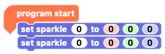
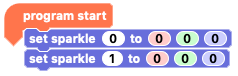
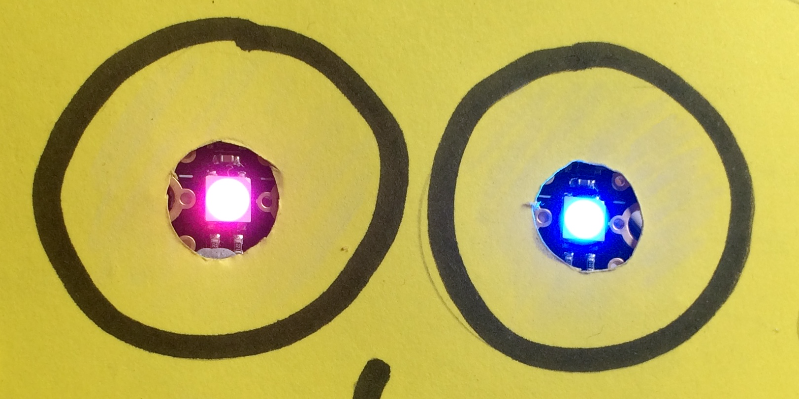

## How to set Sparkle colours using RGB values

Computers make colours by mixing different amounts of red, green, and blue (RGB). Each of the three colours can have a value from 0 to 255, where 0 is no colour at all and 255 is the maximum amount.

If all the RGB values are 0, you get black. If all the RGB values are 255, you get white. You can mix millions of colours by combining the values in between 0 and 255!

--- no-print ---

--- /no-print ---

--- print-only ---

--- /print-only ---

Google provides an online [RGB colour picker](https://www.google.com/search?q=color+picker){:target="_blank"} that you can use to test combinations of colour values.

{:target="_blank"}

[Click on this link to access Google's RGB colour picker](https://www.google.com/search?q=color+picker){:target="_blank"}. Then click or drag the slider and colour space to mix a colour you like. The RGB values of the colour show on the left.

--- task ---

As usual, start with the `program start`{:class="crumblebasic"} block that begins every Crumble program.

Then go to the `Sparkles`{:class="crumblesparkles"} menu and take two `set sparkle 0 to`{:class="crumblesparkles"}`0`{:class="block3myblocks"}`0`{:class="block3operators"}`0`{:class="block3motion"} blocks. Connect them below your `program start`{:class="crumblebasic"} block.

--- /task ---

--- task ---

In the **second** `set sparkle 0 to`{:class="crumblesparkles"}`0`{:class="block3myblocks"}`0`{:class="block3operators"}`0`{:class="block3motion"} block, click on the first `0` and change it to a `1`.

--- /task ---

--- task ---

In **both** `set sparkle to`{:class="crumblesparkles"}`0`{:class="block3myblocks"}`0`{:class="block3operators"}`0`{:class="block3motion"} blocks, enter a value in each of the `red`{:class="block3myblocks"}, `green`{:class="block3operators"} and `blue`{:class="block3motion"} input boxes.

Then click on the green triangle **play** button to run the code and see your Sparkles light up in your chosen colour.

--- /task ---

The Crumble software does not show you what colour your RGB value combination produce. Experiment with combining different values!

--- task ---

Try out some more RGB values.

What colour do you think `red:`{:class="block3myblocks"} 255, `green:`{:class="block3operators"} 0, `blue:`{:class="block3motion"} 255 will create?

What colour do you think `red:`{:class="block3myblocks"} 255, `green:`{:class="block3operators"} 255, `blue:`{:class="block3motion"} 0 will create?

Each time, run your code to see what colours the Sparkles show!

How do you combine RGB values to create orange?

Imagine a colour and try to find the right RGB values to make that colour. Or choose some RBG values and try to guess what colour they will create.

A fun game is to use the `sparkle 0`{:class="crumblesparkles"} colour picker to choose a colour and then challenge someone to set the RGB values for `sparkle 1`{:class="crumblesparkles"} to create the same colour.

--- /task ---