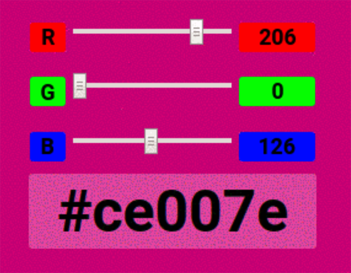
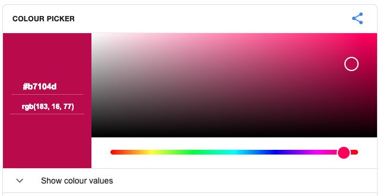
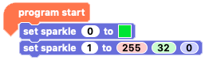
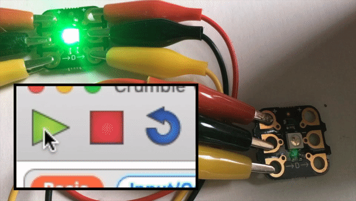
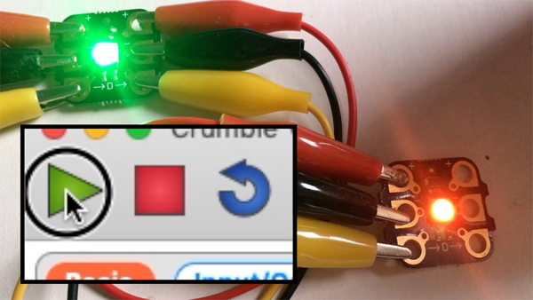

## Coding Sparkle colours using RGB values

Computers show colours by mxing different amounts of red, green and blue (RGB). Each  of these colours can have a value from 0 to 255, where 0 is no colour at all and 255 is the maximum. 

It is more like mixing light than mixing paint though, and you may be surprised by some of the colours that you get.

If all the RGB values are 0, you will get black. If all the values are 255, you will get white, but you can get millions of colours by combining the number in between!

--- no-print ---

--- /no-print ---

--- print-only ---

--- /print-only ---

Google have a neat little [RGB colour picker](https://www.google.com/search?q=color+picker){:target="_blank"} that you can use to explore different colour values.

{:target="_blank"}

Click [this link](https://www.google.com/search?q=color+picker){:target="_blank"} then click or drag the slider and colour space to find the colour of your choice. The RGB values will show to the left.

--- task ---

As usual we start with the `program start`{:class="crumblebasic"} block that starts every bit of Crumble code. Then go to the `Sparkles`{:class="crumblesparkles"} palette and take two `set sparkle 0 to`{:class="crumblesparkles"}`red`{:class="block3myblocks"}`green`{:class="block3operators"}`blue`{:class="block3motion"} blocks and connect them under your `program start`{:class="crumblebasic"} block.

Click on the '0' in the second `set sparkle 0 to`{:class="crumblesparkles"} block and change it to 1.

Enter a value in each or the `red`{:class="block3myblocks"}, `green`{:class="block3operators"} and `blue`{:class="block3motion"} input boxes in the `set sparkle to`{:class="crumblesparkles"} block.

Click the green 'play' triangle to run your code and see what colour combination you just created!

--- no-print ---

--- /no-print ---

--- print-only ---

--- /print-only ---

--- /task ---

The Crumble software does not give you any visual indication as to what your RGB value combination will produce but it's fun to experiment with different mixes. Predict what your combination will produce, run your code and see if 
you were right!

--- task ---

Play around wit the RGB values. 

What colour do you think red:255, green:0 & blue:255 will give you?

What colour do you think red:255, green:255 & blue:0 will give you?

How would you combine red, green and blue values to get orange?

Choose a colour and try and find the right values to make that colour, or choose the RBG values and try to predict what colour you will get.

A fun game here is to use the `sparkle 0`{:class="crumblesparkles"} colour picker to choose a colour and then try and set the RGB values for `sparkle 1`{:class="crumblesparkles"} to get as close as you can. Challenge a code buddy!

Run your code to see if you were right each time!

--- /task ---