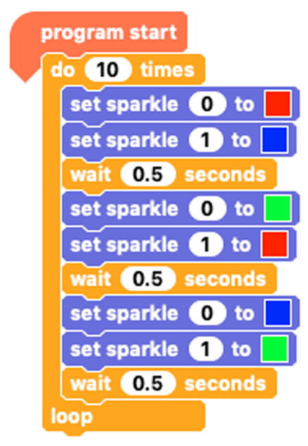

## Two Sparkle sequences

Remember how to connect your second Sparkle to your first one?

--- task ---

Connect croc clips from the right side of the first Sparkle to the left side of the second Sparkle making sure you are connecting positive to positive, negative to negative and signal (D) to signal (D).

--- /task ---

Now you just need to add some code for the second Sparkle.

Remember that the second Sparkle is called `sparkle 1`{:class="crumblesparkles"}!

--- task ---

Let's start by adding a `set sparkle 1 to`{:class="crumblesparkles"} block to sit straight under each `set sparkle 0 to`{:class="crumblesparkles"} block.

Can you see any pattern in the colour sequences? Predict what this code will do when you run it.

Run your code and see if you were right.

--- /task ---

