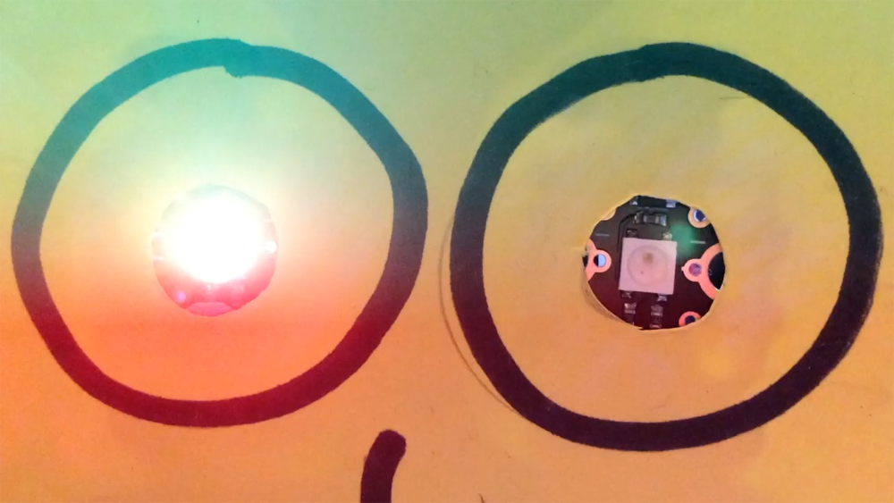

## Create a colour sequence for one Sparkle

Now you will create a colour sequence for `sparkle 0`{:class="crumblesparkles"}.

--- task ---

As always, begin your program with the `program start`{:class="crumblebasic"} block.

From the `Sparkles`{:class="crumblesparkles"} menu, get a `set sparkle 0 to`{:class="crumblesparkles"} block — choose either the colour picker or the RGB values version. 

You need three `set sparkle 0 to`{:class="crumblesparkles"} blocks. Either get two more blocks like this from the menu, or right-click on the `set sparkle 0 to`{:class="crumblesparkles"} block and then click on **Duplicate** to copy it twice.

Connect the three `set sparkle 0 to`{:class="crumblesparkles"} blocks together, and choose a different colour for each:

Can you guess what will happen when you run this code?

Make a guess, and then run the code by clicking on the green triangle **play** button.

--- /task ---

It looks as though the Sparkle skipped the first two colours, but that's not true! What really happened is that the Sparkle lit up in the first two colours so briefly that you couldn's see them.

To solve this problem, you need to add a pause, or `wait`{:class="crumblecontrol"}, after each `set sparkle 0 to`{:class="crumblesparkles"} block:

+ `set sparkle 0 to`{:class="crumblesparkles"}`red`{:class="block3myblocks"} >
+ `wait`{:class="crumblecontrol"} >
+ `set sparkle 0 to`{:class="crumblesparkles"}`green`{:class="block3operators"} >
+ `wait`{:class="crumblecontrol"} >
+ `set sparkle 0 to`{:class="crumblesparkles"}`blue`{:class="block3motion"} >
+ `wait`{:class="crumblecontrol"}

--- task ---

From the `control`{:class="crumblecontrol"} menu, drag out a `wait`{:class="crumblecontrol"} — choose either the seconds or milliseconds version (1000 milliseconds = 1 second).

Set a wait time — one second or less is good.

Duplicate the `wait`{:class="crumblecontrol"} block and connect one of them below each `set sparkle to`{:class="crumblesparkles"} block.

The bottom `wait`{:class="crumblecontrol"} block is not really needed yet, but you will need it for what comes next.

Now run your code again to check whether it works.

--- /task ---

Your Sparkle should light up with each of the different colours, and then stop on your last colour.

Next, use a **loop** to repeat the colour sequence. Everything inside a loop will happen as many times as you want. 

In the Crumble software, the loop block you need is called a `do`{:class="crumblecontrol"} loop. You can remember the name by thinking that you are creating code to `do`{:class="crumblecontrol"} something many times over.

--- task ---

Pull your colour sequence code away from the `program start`{:class="crumblebasic"} block.

From the `control`{:class="crumblecontrol"} menu, grab a `do 10 times`{:class="crumblecontrol"} loop block. Connect the loop block below the `program start`{:class="crumblebasic"} block.

Now put your colour sequence code **inside** the `do 10 times`{:class="crumblecontrol"} loop block.

If you want to change the number of times your colour sequence repeats, change the number in the `do`{:class="crumblecontrol"} loop block.

Run your code to test it.

--- /task ---

--- no-print ---

--- /no-print ---

--- print-only ---

--- /print-only ---

Look at the blocks in the `Sparkle`{:class="crumblesparkles"} menu.

Which block could you add after the `do 10 times`{:class="crumblecontrol"} loop block to make your Sparkle turn off automatically after the last repeat cycle? 