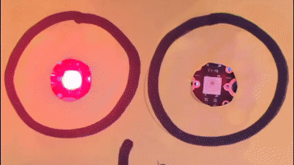

## Colour sequence #1 - Sparkle 0

Now we are going to look at changing our Sparkles' colours and creating a colour sequence.

We'll start by coding a colour sequence just for `sparkle 0`{:class="crumblesparkles"}.

--- task ---

Start with the `program start`{:class="crumblebasic"} block and from the sparkles block palette, choose a `set sparkle 0 to`{:class="crumblesparkles"} block - you can choose either the colour picker or the RGB values version. 

To get more `set sparkle 0 to`{:class="crumblesparkles"} blocks you can drag each block out from the block palette or you can right-click on a block and choose 'duplicate'. Use whichever way you find easiest.

Connect three `set sparkle 0 to`{:class="crumblesparkles"} blocks together and choose a different colour for each.

What do you think will happen when you run this code?

Make a prediction and then run the code.

--- /task ---

It looked as though the Crumble forgot to run the first two colours and went straight to the third but what really happened was that it ran through them so quickly that we couldn't see it.

To solve this problem, we need to put a wait, or pause, between each colour setting block.

`Set colour `{:class="crumblesparkles"}`red`{:class="block3myblocks"} > `wait`{:class="crumblecontrol"} > `Set colour `{:class="crumblesparkles"}`green`{:class="block3operators"} > `wait`{:class="crumblecontrol"} > `Set colour `{:class="crumblesparkles"}`blue`{:class="block3motion"}

--- task ---

From the `control`{:class="crumblecontrol"} block palette, drag out a `wait`{:class="crumblecontrol"}. You can choose either the seconds or milliseconds version (1,000 milliseconds = 1 second) and set a wait time of your choice (one second or less would be good).

Connect a `wait`{:class="crumblecontrol"} block after each `set sparkle to`{:class="crumblesparkles"} blocks.

Now run your code again and check that it works.

--- /task ---

Your Sparkle should light up with each of the different colours that you have programmed and then stop on your last colour.

We didn't really need the last `wait`{:class="crumblecontrol"} block, but we will need it for what comes next.

Next, we are going to make our pattern carry on for longer by using a `repeat`{:class="crumblecontrol"} loop. 

Everything inside our `repeat`{:class="crumblecontrol"} loop will happen as many times as we say, or we can use a `repeat forever`{:class="crumblecontrol"} loop to make it keep going for as long as the program is running or the batteries run out!

In the Crumble software, a `repeat`{:class="crumblecontrol"} loop is written as a `do`{:class="crumblecontrol"} loop because we are coding what to `do`{:class="crumblecontrol"} and how many times to `do`{:class="crumblecontrol"} it.

--- task ---

Pull your colour sequence code away from the `program start`{:class="crumblebasic"} block.

Grab a `do 10 times`{:class="crumblecontrol"} loop block from the `control`{:class="crumblecontrol"} block palette and connect it under the `program start`{:class="crumblebasic"} block.

Now connect your colour sequence code inside the `do 10 times`{:class="crumblecontrol"} loop block.

If you like,  you can change the number of times in the `do 10 times`{:class="crumblecontrol"} loop block to change the number of times your colour sequence will repeat.

Run your code to test it.

--- /task ---

--- no-print ---

--- /no-print ---

--- print-only ---

--- /print-only ---

Look at the blocks in the `Sparkle`{:class="crumblesparkles"} palette. Which block could you add after the `do 10 times`{:class="crumblecontrol"} loop block to make your Sparkle turn off automatically after the last repeat cycle? 