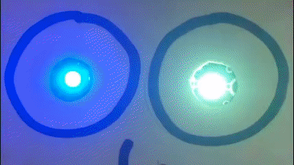
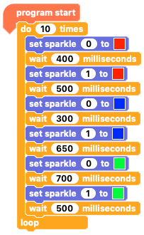
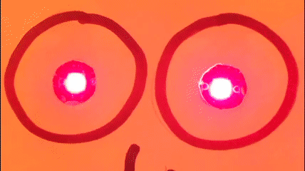
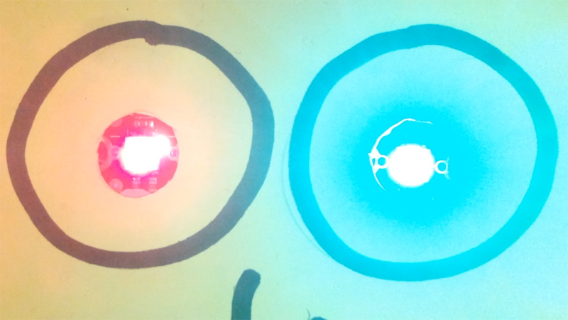
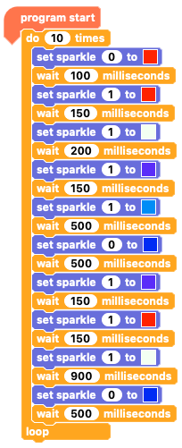
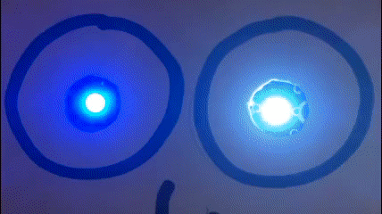
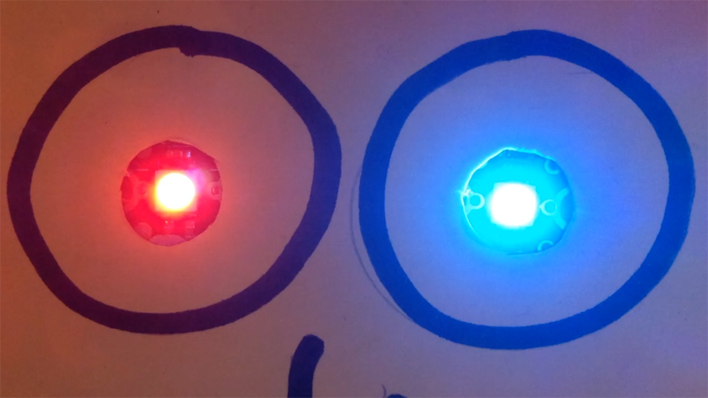

## Create a colour sequence for two Sparkles

Now that you have one Sparkle with a colour sequence, adding a sequence for the second Sparkle is easy.

First, make both Sparkles change colour at the same time.

--- task ---

Carry on with the code for 'sparkle 0'.

Duplicate one of the `set sparkle 0 to`{:class="crumblesparkles"} blocks.

In the duplicated block, change the `0` to a `1`.

Now you have a `set sparkle 1 to`{:class="crumblesparkles"} block. Duplicate this block two times.

Put one `set sparkle 1 to`{:class="crumblesparkles"} blocks below each `set sparkle 0 to`{:class="crumblesparkles"} block.

If you like:
+ Change the colours in the `set sparkle 1 to`{:class="crumblesparkles"} blocks.
+ Adjust the `wait`{:class="crumblecontrol"} times.

Run the code by clicking on the green triangle **play** button, and watch what happens.

--- /task ---

--- no-print ---

--- /no-print ---

--- print-only ---

--- /print-only ---

There is no reason why the two Sparkles need to change colour at the same time.

--- task ---

The easiest way to make the Sparkles change colour at different times is to add a `wait`{:class="crumblecontrol"} block in between the `set sparkle 0 to`{:class="crumblesparkles"} blocks and the `set sparkle 1 to`{:class="crumblesparkles"} blocks.

Adjust the wait times for a sequence speed that you like.

Click on the green triangle **play** button and watch what happens.

--- /task ---

--- no-print ---

--- /no-print ---

--- print-only ---

--- /print-only ---

Now get creative and make a sequence where the two Sparkles change in any order, timing, and colours you feel like.

You don't even have to alternate the Sparkles. You could make `Sparkle 0`{:class="crumblesparkles"} stay the same while `Sparkle 1`{:class="crumblesparkles"} flashes all the colours of the rainbow.

What do you want your Sparkles to do?

If you want to create a complicated sequence, plan it out on of paper first.

--- task ---

Add `wait`{:class="crumblecontrol"} blocks and `set sparkle to`{:class="crumblesparkles"} blocks to create whatever sequence you feel like.

Think about what your sequence will look like. Then run your program to see whether it creates the sequence you want.

Click on the green triangle **play** button and check that your sequence is what you expect.

--- /task ---

--- no-print ---

--- /no-print ---

--- print-only ---

--- /print-only ---