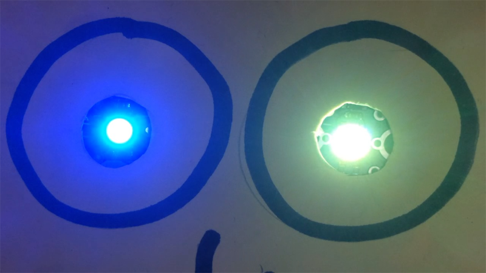

## Colour sequence 2 - both Sparkles

Now that you have one sparkle with a colour sequence, adding a sequence to the second will be easy.

First we'll add a sequence where both Sparkles change at the same time.

--- task ---

Carrying right on from the code that we had before, in Colour sequence 1, add more `set sparkle 0 to`{:class="crumblesparkles"} blocks either from the `Sparkle`{:class="crumblesparkles"} blocks palette or by duplicating the ones that you already have. 

Hint: We will have to change them to `set sparkle 1 to`{:class="crumblesparkles"} so it is easiest to change one and then duplicate that.

Put one of the new `set sparkle 0 to`{:class="crumblesparkles"} blocks under each existing `set sparkle 0 to`{:class="crumblesparkles"} block and chnage the `0`{:class="crumblesparkles"}s to `1`{:class="crumblesparkles"}s to make them `set sparkle 1 to`{:class="crumblesparkles"} blocks.

Leave or adjust the wait times for a sequence speed that you like. You don't have to have all the wait times the same as each other.

Click the green play button and see what you have.

--- /task ---

--- no-print ---

--- /no-print ---

--- print-only ---

--- /print-only ---

But there is no reason why you need to have the two Sparkles changing colour at the same time at all.

--- task ---

You could move the blocks around into a different order but the easiest way to make them change at different times is to add a `wait`{:class="crumblecontrol"} block between the `set sparkle 0 to`{:class="crumblesparkles"} blocks and the `set sparkle 1 to`{:class="crumblesparkles"} blocks.

Again, adjust the wait times for a sequence speed that suits you and change the colours too if you like.

Click the green play button and see what your code does.

--- /task ---

--- no-print ---

--- /no-print ---

--- print-only ---

--- /print-only ---

If you have a complicated sequence in mind it really helps to plan it out on a piece of paper first, but for now let's get creative and make a sequence where the two Sparkles chnage in any order, timings and colours you feel like.

That means you don't even have to alternate the Sparkles. You might have `Sparkle 0`{:class="crumblesparkles"} staying the same while `Sparkle 1`{:class="crumblesparkles"} flashes all the colours of the rainbow. What do you want your Sparkles to do?

--- task ---

Add `wait`{:class="crumblecontrol"} blocks and `set sparkle to`{:class="crumblesparkles"} blocks as you like to create whatever sequence you feel like. You really can't go wrong. Try to think about what your sequence will look like when you run it and then see if you were right.

Click the green play button and see if your sequence is what you were expecting.

--- /task ---

--- no-print ---

--- /no-print ---

--- print-only ---

--- /print-only ---