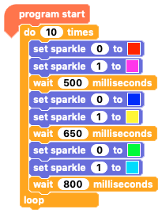

## Colour sequence 2 - both Sparkles

Now that you have one sparkle with a colour sequence, adding a sequence to the second will be easy.

First we'll add a sequence where both Sparkles change at the same time.

--- task ---

Carrying right on from the code that we had before, add more `set sparkle 0 to`{:class="crumblesparkles"} blocks either from the `Sparkle`{:class="crumblesparkles"} blocks palette or by duplicating the ones that you already have. 

Hint: We will have to change them to `set sparkle 1 to`{:class="crumblesparkles"} so it is easiest to change 1 and then duplicate that one.

Put one of the new `set sparkle 0 to`{:class="crumblesparkles"} blocks under each existing `set sparkle 0 to`{:class="crumblesparkles"} block and chnage the `0`{:class="crumblesparkles"}s to `1`{:class="crumblesparkles"}s to make them `set sparkle 1 to`{:class="crumblesparkles"} blocks.

Leave or adjust the wait times for a sequence speed that you like. You don't have to have all the wait times the same as each other.

Click the green play button and see what you have.

--- /task ---

--- no-print ---

--- /no-print ---

--- print-only ---

--- /print-only ---