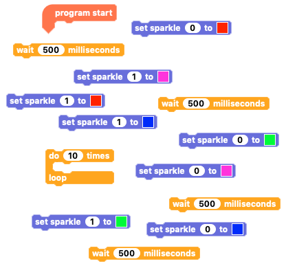
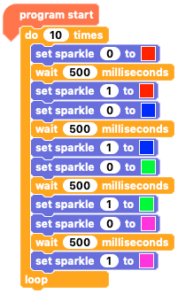

## Challenge: Follow me light sequence

Can you code your Sparkle creature's eyes to flash in a sequence where one eye (Sparkle 1) turns the colour of the other eye (Sparkle 0) but the moment it does the leading eye (Sparkle 0) changes to a new colour?

Can you code this 'follow me' sequence so that the second eye chases the first through the colours red, blue, green and pink and repeat 10 times?

--- no-print ---

--- /no-print ---

--- print-only ---

--- /print-only ---

--- hints ---

--- hint ---

Try and write code so that when the `program starts`{:class="crumblebasic"}, `repeat ten times`{:class="crumblecontrol"} `Sparkle 0`{:class="crumblesparkles"} turns `red`{:class="block3myblocks"}, then `wait half a second`{:class="crumblecontrol"} before `Sparkle 1`{:class="crumblesparkles"} turns `red`{:class="block3myblocks"} and `Sparkle 0`{:class="crumblesparkles"} turns `blue`{:class="block3mymotion"}. `Wait`{:class="crumblecontrol"} again before `Sparkle 1`{:class="crumblesparkles"} also turns `blue`{:class="block3motion"} and `Sparkle 0`{:class="crumblesparkles"} turns `green`{:class="block3operators"}. Again, `wait`{:class="crumblecontrol"} before `Sparkle 1`{:class="crumblesparkles"} becomes `green`{:class="block3operators"} and `Sparkle 0`{:class="crumblesparkles"} turns `pink`{:class="block3sound"}. Finally, `wait`{:class="crumblecontrol"} one last time and turn `Sparkle 1`{:class="crumblesparkles"} `pink`{:class="block3sound"}

--- /hint ---

--- hint ---

You will need to use the blocks below to create the follow me colour sequence code.

Can you rearrange them to make the code work?

--- /hint ---

--- hint ---

Arrange the code blocks to make the code below:

Click the green 'play' button to see if it works as you expect.

--- /hint ---

--- /hints ---

