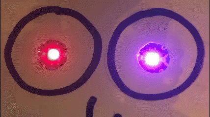
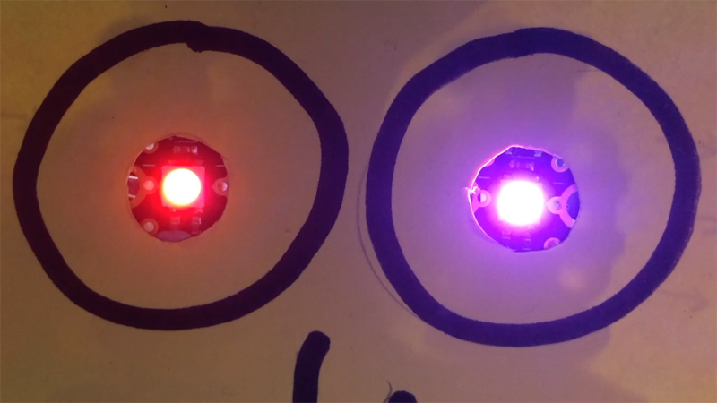

## Challenge: Follow me light sequence

Can you code your Sparkle creature's eyes to flash in a sequence where one eye (Sparkle 1) turns the colour of the other eye (Sparkle 0) but the moment it does the leading eye (Sparkle 0) changes to a new colour?

Can you code this 'follow me' sequence so that the second eye chases the first through the colours red, blue, green and pink and repeat 10 times?

--- no-print ---

--- /no-print ---

--- print-only ---

--- /print-only ---

