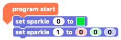

Now we need to add some code to make the second Sparkle turn on.

--- task ---

In the Crumble software on your computer, we're going to try a new block from the Sparkle block palette.

Drag out the `set sparkle to`{:class="crumblesparkles"} block that ends with the three RGB value input boxes, `0`{:class="block3myblocks"} `0`{:class="block3operators"} `0`{:class="block3motion"} and connect it under your existing `set sparkle to`{:class="crumblesparkles"} block.

--- /task ---

At the moment, both Sparkle blocks are set for `sparkle 0`{:class="crumblesparkles"}. 

The first Sparkle connected to the Crumble is given the name `sparkle 0`{:class="crumblesparkles"}, which slightly confusingly makes the second Sparkle, `sparkle 1`{:class="crumblesparkles"} and so on.

--- task ---

Set your second `set sparkle to`{:class="crumblesparkles"} block to control our second Sparkle, `sparkle 1`{:class="crumblesparkles"}, by clicking on the 0 inside the input box right after `set sparkle`{:class="crumblesparkles"}, inputting '1' and then pressing RETURN on the keyboard.

--- no-print ---

--- /no-print ---

--- print-only ---

--- /print-only ---

--- /task ---

### RGB colour mixing

