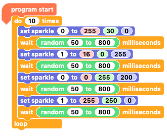

## Create a colour sequence with random pauses

Make your creature's eyes change colour at random times by using random numbers in the `wait`{:class="crumblecontrol"} blocks.

--- task ---

Begin with the `program start`{:class="crumblebasic"} block.

From the `control`{:class="crumblecontrol"} menu and add a `do 10 times`{:class="crumblecontrol"} loop block.

--- /task ---

--- task ---

**Inside** the `do 10 times`{:class="crumblecontrol"} loop, add two `set sparkle 0 to`{:class="crumblesparkles"}`0`{:class="block3myblocks"}`0`{:class="block3operators"}`0`{:class="block3motion"} RGB value blocks. 

Change the **second** `set sparkle 0 to`{:class="crumblesparkles"}`0`{:class="block3myblocks"}`0`{:class="block3operators"}`0`{:class="block3motion"} RGB value block so it says `sparkle 1`{:class="crumblesparkles"}.

--- /task ---

--- task ---

Set **both** `set sparkle 0 to`{:class="crumblesparkles"}`0`{:class="block3myblocks"}`0`{:class="block3operators"}`0`{:class="block3motion"} RGB value blocks to colours of your choice.

Attach a `wait`{:class="crumblecontrol"} block below.

--- /task ---

Now you need another set of `set sparkle`{:class="crumblesparkles"} blocks and another `wait`{:class="crumblecontrol"} block. The quickest way is to duplicate the blocks you already have.

When you duplicate blocks in Crumble, you duplicate the block you right-click on **and** all the blocks attached to it.

--- task ---

Right-click on the first `set sparkle`{:class="crumblesparkles"} block and then click on **duplicate**.

Drag the duplicated blocks inside the `repeat`{:class="crumblecontrol"} loop and below the `wait`{:class="crumblecontrol"} block that's already there.

--- no-print ---

--- /no-print ---

--- print-only ---

--- /print-only ---

--- /task ---

--- task ---

Change the colours of the second pair of `set sparkle to`{:class="crumblesparkles"}`0`{:class="block3myblocks"}`0`{:class="block3operators"}`0`{:class="block3motion"} RGB value blocks.

--- /task ---

Now you're going to create the random pause between colour changes.

--- task ---

From the `Operators`{:class="crumbleoperators"} menu, grab two `random 0 to 10`{:class="crumbleoperators"} blocks.

Place one `random 0 to 10`{:class="crumbleoperators"} block **inside** each of your two `wait`{:class="crumblecontrol"} blocks.

Your `wait`{:class="crumblecontrol"} blocks now create pauses of a random length between `0 to 10`{:class="crumbleoperators"} `seconds`{:class="crumblecontrol"}.

Inside **both** `random`{:class="crumbleoperators"} blocks, change the values to `1` and `3`.

Now you have `wait`{:class="crumblecontrol"} `1 to 3`{:class="crumbleoperators"} `seconds`{:class="crumblecontrol"} blocks!

Click on the green triangle **play** button to check what your code does.

--- /task ---

--- task ---

Replace the `wait seconds`{:class="crumblecontrol"} blocks with `wait milliseconds`{:class="crumblecontrol"} blocks.

Because `1 to 3`{:class="crumbleoperators"} `milliseconds`{:class="crumblecontrol"} is a tiny amount of time, change the `random`{:class="crumbleoperators"} block values to something more suitable, for example `300 to 2100`{:class="crumbleoperators"}. That is the same as `0.3 to 2.1`{:class="crumbleoperators"} `seconds`{:class="crumblecontrol"}.

Click on the green triangle **play** button to check how different your colour sequence looks now.

--- /task ---

Finally, make the two eyes change at different times. 

--- task ---

Duplicate one of the `wait`{:class="crumblecontrol"}`random`{:class="crumbleoperators"} blocks **twice**.

Place the two new `wait`{:class="crumblecontrol"}`random`{:class="crumbleoperators"} blocks so that there is a `wait`{:class="crumblecontrol"} block after each `set sparkle to`{:class="crumblesparkles"} block. 

In the example, I have reduced the values in the `wait`{:class="crumblecontrol"}`random`{:class="crumbleoperators"} blocks to make the sequence run faster.

Click on the green triangle **play** button. Now your creature's Sparkle eyes should take it in turns to change colour.

Observe the colour changes. Which sequence do you like best?

--- /task ---

--- no-print ---

--- /no-print ---

--- print-only ---

--- /print-only ---

